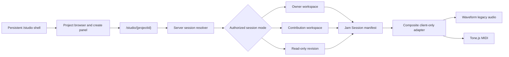

# Studio-forward workspace refactor plan

Status: Exploratory proposal; no implementation authority  
Prepared: 2026-07-14  
Recommended timing: decide the contracts before MIDI-01; implement the main route and experience refactor after MIDI-07

## Executive recommendation

The proposed direction is sound. Jam Session should present the studio as a top-level, persistent workspace that opens, creates, and switches between projects. Projects remain the durable collaboration and history boundary, but they should no longer appear to own a separate studio application.

The target mental model should be:

> Open Jam Session Studio, then choose what music to work on.

This is mostly an information-architecture and application-shell inversion. It should **not** introduce a new database-level `studio` entity, weaken project authorization, or change immutable revision semantics. The existing `projects`, `workspaces`, revisions, contribution workspaces, manifests, RLS, and private source delivery remain the domain authority.

The recommended canonical routes are:

- `/studio` — authenticated studio home with no project loaded;
- `/studio/{projectId}` — the persistent studio shell with one authorized project/session loaded; and
- `/projects/{projectId}/studio` — temporary compatibility redirect to `/studio/{projectId}`.

The proposal is realistic with the current stack. Project loading, creation, switching, vertical track reordering, timeline movement, trimming, and splitting are achievable. Splitting is blocked by Jam Session's current one-region-per-track persistence contract rather than by Waveform Playlist. Independent playback-speed and pitch controls are a separate DSP problem and should not be promised as part of the structural refactor.

I would not wait until every MIDI PR is finished to make all design decisions. The main implementation can wait, but the route-neutral session contract, studio-first project creation flow, manifest-v2 clip shape, and future engine-portability rules should be decided before MIDI-01/MIDI-02. Otherwise the MIDI work may encode the current project-first assumptions and the data model may need a second immediate migration.

## Product and architecture alignment

This proposal supports the current PRD rather than changing Jam Session into a professional DAW:

- The PRD already describes an integrated browser workspace for synchronized MIDI and compatible legacy audio.
- The PRD explicitly says Jam Session is not intended to replace Ableton Live, FL Studio, Logic, or Pro Tools.
- The roadmap already plans a Jam Session-owned composite MIDI/audio adapter and manifest v2.
- ADR-003 still applies: mutable private workspaces sit on immutable revision history.
- ADR-004 still applies: the Jam Session manifest, not an editor's live object graph, is the portable authority.
- ADR-006 still applies for the MVP: Waveform Playlist remains the legacy-audio implementation behind the client-only adapter.
- ADR-007 still applies: MIDI is the active prototype creation path after the parity gate, while existing audio history remains supported.

The DAW inspiration should therefore guide hierarchy, speed, keyboard interaction, timeline behavior, and visual density. It should not imply plugin hosting, arbitrary effects graphs, automation lanes, professional time stretching, or proprietary DAW project compatibility.

## Current state and leverage points

The current implementation has several good foundations:

- `/projects/{projectId}/studio` is a Server Component that authorizes the viewer, resolves the project/workspace/revision, and then lazy-loads a browser-only studio.
- `StudioLauncher` and `StudioSurface` already accept distinct revision, owner-workspace, contribution-workspace, and contribution-version modes.
- The adapter is isolated under `src/features/studio/waveform-playlist-adapter`.
- The manifest already persists track order, start position, source trim, duration, gain, pan, mute, and solo.
- Workspace autosave already uses optimistic concurrency and device-local recovery.
- Source loading is manifest-first, cancellable, progressive, actor-scoped, and safe to reuse during the same browser session.
- The current project index RPC is bounded and RLS-scoped, so it can seed a studio project browser.
- The pinned Waveform Playlist engine already contains move, trim, split, collision, snap, and undo/redo primitives; Jam Session currently exposes only part of them.

The main constraints are:

- route ownership and navigation still communicate “a project contains a studio”;
- project creation redirects to the project detail page and does not create an empty editable workspace;
- the current audio manifest permits one track per unique asset and one contiguous clip per track;
- database projections store audio position/trim/duration on the track row, not as multiple clip rows;
- switching projects is currently a full navigation with no explicit dirty/saving/conflict handoff;
- the studio surface combines loading, transport, mixer, timeline, recovery, publishing, exporting, and contribution context in one large client component; and
- `manifest.workspaceId` is currently checked against `project_id`, so the v1 field name does not describe what it actually identifies.

## Target user experience

### Opening the studio

The global authenticated navigation gains a first-class **Studio** destination. Opening `/studio` should render the studio chrome immediately without loading Waveform Playlist, Tone.js, or private audio.

The empty workspace should contain:

- **New project** as the primary action;
- **Open project** with search/filter and a bounded recent list;
- **Continue working** for projects with active owner or contribution workspaces;
- clear read-only labels for projects the viewer can listen to but cannot edit; and
- honest desktop/browser capability messaging before an editing session is selected.

This is a DAW-like start center, not another dashboard. The dashboard remains the cross-product work summary; `/projects` remains the complete project-management index.

### Loading a project

Selecting a project navigates to `/studio/{projectId}` while preserving the `/studio` layout. The URL remains deep-linkable, refresh-safe, and understandable. The studio shell stays mounted; the loaded session subtree is replaced.

The selected project appears in a compact title bar with:

- project title and ownership/contribution context;
- current revision/base state;
- autosave or read-only status;
- a project switcher;
- project details/history link;
- publish or submit action when applicable; and
- an explicit close command that returns to `/studio`.

Do not load more than one active project editor at a time in the first version. “Quickly swap” should mean safe, fast serial switching with recent projects and decoded-source reuse—not multiple live tabs holding several Web Audio graphs and autosave machines in memory.

### Creating a project inside the studio

“New project” should open a studio-owned panel or dialog rather than send the user to a separate product page. The initial form should collect the existing required project metadata, with musician-focused defaults and progressive disclosure for secondary taxonomy.

Creation should atomically produce:

1. the private project and owner membership;
2. the initial empty MIDI-capable workspace/manifest; and
3. the identifiers needed to redirect directly to `/studio/{projectId}`.

This should be a single database command once the MIDI model supports a zero-revision workspace. Avoid a client-orchestrated “create project, then create workspace” sequence that can leave a stranded project when the second operation fails.

The existing `/projects/new` route can remain as an alternate entry and use the same command/form contract. Its successful destination should become `/studio/{projectId}`.

### Switching projects safely

Switching follows an explicit state machine:

1. If the current session is clean or read-only, switch immediately.
2. If edits are pending and online, complete the current optimistic save and require its acknowledgement.
3. If a save is in flight, show “Saving before switching” and disable repeated selection.
4. If the draft is offline, conflicted, or failed, do not silently switch. Offer **Stay here** or **Leave with a recovery copy**, explaining that the device-local copy is not the server authority.
5. Abort outstanding signing/fetch/decode work for the old session.
6. Pause playback, dispose the old adapter/audio graph, and clear session-only mixer state.
7. Navigate to the new canonical studio URL.
8. Prepare placeholder lanes from the new manifest, then progressively attach peaks/audio or MIDI runtime state.

The existing actor-scoped decoded-buffer registry may reuse immutable audio for a second authorized project that references the same asset, but every new session must still be authorized through its own server/RLS path. A cached buffer is a performance aid, never proof of access.

## Proposed route and component structure

```text
src/app/studio/
  layout.tsx                 # authenticated persistent studio shell; no loading.tsx
  page.tsx                   # empty/start-center state
  [projectId]/page.tsx       # server-authorized session resolver

src/app/projects/[projectId]/studio/page.tsx
                              # temporary redirect only

src/features/studio/
  shell/                     # project browser, title bar, create panel, switch coordinator
  session/                   # engine-neutral session descriptor and lifecycle
  manifest/                  # all supported manifest schemas and migrations
  waveform-playlist-adapter/ # legacy audio implementation boundary
  midi-adapter/              # planned MIDI implementation boundary or documented successor
```

Do not add `loading.tsx` at `src/app/studio` or its dynamic child while Next.js 16.2.10 is pinned. The repository's documented Firefox development-streaming workaround must move with the canonical studio route and remain until the upstream issue is deliberately revalidated.

The persistent layout should own navigation chrome and lightweight project-list state. The dynamic page should own the authorized session descriptor. The browser editor should remount for each project switch so its audio graph, autosave generation, recovery key, and abort controller cannot leak into the next session.



## Session contract

Replace the route-shaped `StudioLauncherProps` union with a smaller engine-neutral `StudioSessionDescriptor` returned by one server resolver. It should distinguish at least:

| Mode                        | Viewer experience                      | Mutable authority                          | Primary completion action               |
| --------------------------- | -------------------------------------- | ------------------------------------------ | --------------------------------------- |
| Empty                       | Start center                           | None                                       | Create or open project                  |
| Owner workspace             | Editable                               | Active viewer-owned project workspace      | Publish revision                        |
| Contribution workspace      | Editable while draft/changes requested | Active author-owned contribution workspace | Submit contribution                     |
| Member revision             | Read-only                              | Current immutable revision                 | Start/continue contribution if eligible |
| Contribution version review | Read-only comparison/review            | Immutable submitted version                | Review from contribution flow           |

The resolver should continue using verified identity, repositories, database authorization, and RLS. The project picker can hide inaccessible choices for usability, but the selected route must independently authorize the resource.

The descriptor should provide data, capabilities, and canonical links—not infer capabilities in the client from owner IDs or route shape. Example capability flags include `canEdit`, `canPublish`, `canSubmit`, `canStartContribution`, `canDownloadSources`, and `canFork`.

Keep project management and studio session concerns separate:

- Project: metadata, visibility, collaboration settings, membership, license, lineage, current revision.
- Workspace: one viewer's mutable draft based on an exact revision.
- Studio session: ephemeral authorized browser context presenting a workspace or revision.
- Manifest: portable persisted arrangement authority.
- Adapter: runtime implementation of the manifest's supported editing/playback capabilities.

No `studios` table is needed.

## Project browser and recent work

Start with the existing bounded `list_viewer_projects` behavior rather than building a new unbounded client query. Add a studio-specific projection/RPC only if measurements show the existing projection cannot provide the needed fields.

The first project-browser result shape should include:

- project ID/title/status/role and current revision ID;
- active workspace ID, type, base revision, updated time, and conflict/stale indicator when visible to the viewer;
- whether a contribution needs attention;
- compatibility (`midi` or `legacy_hybrid`) after the MIDI migration; and
- a bounded, opaque cursor.

Use server-derived `updated_at` ordering for the initial recent list. Do not add cross-device “last opened” persistence in the first slice. If product evidence later supports it, add a narrow private preference/event with retention and rate limits; do not overload public activity or project `updated_at` merely because someone opened a project.

## Manifest and data-model implications

### Preserve manifest v1

Published manifest-v1 revisions and existing workspaces must remain readable forever under the current compatibility contract. Do not edit or reinterpret old JSON in place.

When manifest v2 is introduced for MIDI, correct the misleading v1 identity name. The new portable document should use `projectId` (or another explicitly documented project identity), not call a project ID `workspaceId`. The actual mutable workspace row ID remains envelope metadata because the same musical document shape is used in immutable revisions and submissions.

### Decide the audio clip model before MIDI migrations

The current planned manifest-v2 design discriminates audio and MIDI tracks, but the current data-design text still describes the audio side largely as the v1 one-region shape. If trimming/splitting is a desired near-term feature, v2 should introduce stable clip identity for both kinds before its schema is frozen.

Recommended bounded audio shape:

- an audio track retains one source `assetId`, mixer state, ordering, instrument, and attribution boundary;
- the track owns `clips[]` with stable `clipId`, `positionMs`, `trimStartMs`, and `durationMs`;
- all clips on that initial audio track reference the same immutable source asset;
- clips may not overlap on the same track in the simple studio;
- split produces two adjacent clips referencing the same source bytes;
- trim changes clip source offset/duration and never rewrites the source asset; and
- a v1 track maps deterministically to one v2 audio track containing one clip.

Keeping one source asset per audio track avoids an immediate credit-model expansion: the existing per-track source-credit snapshots remain coherent. Cross-track clip movement or mixing multiple source assets on one track should remain out of scope until attribution, normalized projections, and retention semantics are explicitly designed.

Add normalized clip projections for workspace, revision, and contribution-version state in the same migration family as MIDI clips. Save, publish, submit, accept, and fork must prove manifest/projection equivalence. Workspace clip rows are replaced only through the optimistic complete-manifest command; revision and contribution-version clip rows are immutable.

This is an intentional expansion of the currently accepted persisted subset and therefore requires an ADR/design update before implementation.

### No schema change for the studio shell itself

The new route, start center, project switcher, and session descriptor should not require a schema migration. Database changes are justified only for:

- atomic project-plus-empty-workspace creation;
- MIDI compatibility/manifest v2 already planned;
- multi-clip normalized projections; or
- later persisted DSP parameters that pass their feasibility gates.

Any new exposed table or RPC requires explicit grants, RLS, actor-matrix tests, generated type updates, and a clean reset. Current Supabase behavior may not automatically expose new SQL-created tables through the Data API, so access grants and RLS must be treated as separate checks.

## DAW-oriented UI structure

The first UI revamp should improve hierarchy without imitating another product's protected visual design.

Recommended regions:

1. **Application/title bar** — Studio, project switcher, project name, save state, project/history link, create/open commands.
2. **Transport bar** — play/pause/stop, position, loop/metronome when supported, tempo/time signature, zoom, follow.
3. **Left browser** — recent projects and, once MIDI exists, available built-in instruments; collapsible to preserve timeline width.
4. **Track headers/channel strips** — selection, drag handle, name, arm where applicable, mute/solo, compact gain/pan, readiness.
5. **Timeline/arrangement** — ruler, playhead, clips, selection, move/trim/split gestures.
6. **Inspector** — selected track/clip properties with precise keyboard-editable values.
7. **Bottom/status area** — autosave, offline/conflict/recovery, source readiness, actionable errors.

Publish, submission, source download, and WAV/MIDI export should move into coherent project/file actions instead of occupying full-width cards beneath the timeline. Destructive or history-changing actions still require clear labels and confirmation proportional to risk.

Continue using the brand's warm studio-night tokens, semantic colors, pill actions, short waveform lanes, and accessible focus treatment. A DAW-like layout can be denser than ordinary product pages, but it must keep keyboard alternatives, readable status, reduced-motion support, and the current desktop capability gate.

## Editing feature feasibility

| Requested capability                               | Feasibility with the pinned stack     | Actual work/risk                                                                                                                                                                                       | Recommendation                                                             |
| -------------------------------------------------- | ------------------------------------- | ------------------------------------------------------------------------------------------------------------------------------------------------------------------------------------------------------ | -------------------------------------------------------------------------- |
| Drag tracks vertically to reorder                  | High                                  | Wire dnd-kit to `reorderTracks`, preserve buttons/keyboard alternative, autosave one canonical order                                                                                                   | Implement in first DAW interaction slice                                   |
| Move audio forward/back on timeline                | High                                  | Enable Waveform Playlist clip interaction, snap policy, propagate `onTracksChange`, test placeholder/decoded parity                                                                                    | Implement with drag plus numeric inspector                                 |
| Trim clip edges                                    | High                                  | Library already models offset/duration and boundary constraints; Jam manifest already has one trim range                                                                                               | Implement for the existing single clip, then preserve under v2 clips       |
| Split audio                                        | Technically high, product/data medium | Library engine supports split; Jam Session manifest and normalized projections do not support multiple audio clips today                                                                               | Implement only after v2 multi-clip contract and database commands exist    |
| Undo/redo                                          | High for session state                | Waveform engine supports transaction history; must integrate with autosave/recovery and not imply revision-history undo                                                                                | Add with move/trim/split, session-local only                               |
| Simple per-track varispeed that also changes pitch | Medium                                | Current public multitrack adapter does not expose it; custom playout scheduling, waveform duration, seeking, export, and persistence all change                                                        | Spike only; label honestly as coupled speed/pitch if adopted               |
| Speed change while preserving pitch                | Low-to-medium                         | The pinned single-track MediaElement mode supports pitch-preserving rate, but the multitrack Tone playout does not expose equivalent per-track stretching; robust time stretching needs additional DSP | Defer unless a measured DSP spike meets quality/CPU/export gates           |
| Pitch shift while preserving duration              | Medium                                | Tone.js contains `PitchShift`, but Jam Session does not currently persist/apply it; latency, artifacts, CPU, browser variance, and offline export need proof                                           | Run a narrow semitone-based per-track spike; do not promise production yet |

### What Waveform Playlist can realistically do

The pinned `@waveform-playlist/browser@15.3.4` and engine packages already expose clip dragging, boundary trimming, splitting, collision constraints, snapping, and undo/redo. The upstream project also documents multiple clips per track with drag-to-move and trim, and its engine exposes `moveClip`, `trimClip`, and `splitClip` operations.

Jam Session currently maps every persisted track to `clips[0]` and exports only that clip. That is why split is not merely a button addition. If a second clip were created today, `editorTracksToManifest` would discard it and the database projection could not prove it.

### Playback speed

“Playback speed of a track” needs a product definition before implementation:

- **Varispeed:** faster/shorter/higher pitch or slower/longer/lower pitch. This follows native buffer playback behavior and is the more feasible option, but the multitrack Waveform Playlist public adapter still needs extension.
- **Time stretch:** faster/slower while pitch remains stable. This is what many users will expect from a modern DAW. It is substantially harder and is not provided by the pinned multitrack playout path.
- **Global audition speed:** the whole project changes speed together. This is different from transforming one track and may be useful for practice/review, but it should normally be session-only and not alter the arrangement.

Do not expose a control called simply “Speed” until the chosen behavior, waveform/timeline duration, export result, and collaboration persistence are defined.

### Pitch

Tone.js offers a near-real-time pitch-shift effect measured in semitones. This makes a bounded per-track pitch control plausible, but not automatically production-ready. The feasibility spike must test:

- vocals, drums, bass, and harmonic material at small and large intervals;
- added latency and transport alignment;
- CPU/memory with the project track ceiling;
- Safari, Firefox, Chrome, and Edge behavior;
- live playback versus offline WAV export equivalence;
- save/reload determinism and exact engine-version compatibility;
- contribution/revision/fork round trips; and
- accessible bypass/reset and clear semitone labels.

If the quality gate fails, pitch should remain deferred to OpenDAW or a later dedicated DSP decision. Avoid adding a heavy time-stretch/pitch dependency merely to check a roadmap box.

## Future OpenDAW compatibility

The proposed studio shell should be engine-neutral now, but it should not implement engine selection, premium entitlements, or OpenDAW code during this work.

The future direction is plausible if the contracts stay asymmetric:

- **Simple/Waveform to OpenDAW:** import the Jam Session manifest subset—tempo, time signature, track order, source clips, MIDI notes/clips, gain/pan/mute, and supported attribution—into a newly created OpenDAW session.
- **OpenDAW to Simple/Waveform:** reject as a project conversion. Offer rendered stems and/or bounded MIDI export as an explicit lossy workflow only if licensing, storage, credits, and source-admission policy later allow it.

Do not make `engine = waveform-playlist` the conceptual owner of the shared project format. Manifest v2 should identify the Jam Session format/capability version, while adapter-specific compatibility metadata remains explicit. A future user preference can choose which capable adapter opens a compatible project; it must not rewrite immutable history merely because the preferred editor changed.

OpenDAW currently advertises an SDK and is licensed under AGPL-3.0. Jam Session's existing architecture correctly requires a separate licensing/hosting review and superseding ADR before integration. A commercial “premium” offering may need a commercial license or a deliberately AGPL-compliant deployment model; this is a legal/product gate, not just an engineering toggle.

## Recommended delivery sequence

### Decision checkpoint — before MIDI-01

Documentation/architecture only:

- Accept or reject the top-level `/studio` and `/studio/{projectId}` route model.
- Amend the roadmap/architecture route map and add an ADR for the studio-first shell.
- Decide whether manifest v2 includes stable audio clips as well as MIDI clips.
- Define `StudioSessionDescriptor` independently of a route and editor engine.
- Define atomic MIDI project-plus-empty-workspace creation.
- Correct the manifest identity naming in v2 while retaining the v1 parser.
- Record OpenDAW as a future adapter/import target only, with no entitlement schema.

This checkpoint should occur after OPT-05 and before MIDI format/schema work is frozen.

### STUDIO-01 — Canonical shell and route migration

Outcome: an authenticated user can open a project-independent Studio start center, and all existing studio links resolve to the new canonical route.

Scope:

- add the persistent `/studio` layout and empty page;
- add `/studio/{projectId}` using the existing server authorization and launcher behavior;
- redirect the old nested route;
- add top-level Studio navigation and change project CTAs to “Open in studio”;
- preserve browser-only lazy loading and the Firefox `loading.tsx` exception; and
- add route, auth, not-found, redirect, and no-editor-on-empty-page tests.

Do not change manifests or database behavior in this slice.

### STUDIO-02 — Project browser and safe switching

Outcome: users can load and switch among authorized recent projects without losing an acknowledged draft.

Scope:

- bounded project picker with role/workspace/read-only state;
- canonical navigation and recent selection;
- save-before-switch coordinator;
- conflict/offline/recovery decision UI;
- abort/dispose lifecycle and playback stop;
- decoded-source reuse only after new-session authorization; and
- E2E coverage for clean, dirty, saving, conflict, unauthorized, and source-loading switches.

### STUDIO-03 — Studio-owned creation

Outcome: a user creates a MIDI-first project from Studio and lands in its immediately editable empty workspace.

Scope:

- shared project form contract in a studio panel/dialog;
- atomic database command for project, membership, and empty workspace;
- idempotency and RLS actor matrix;
- direct transition to `/studio/{projectId}`;
- make `/projects/new` reuse the same behavior; and
- prove retry does not create duplicate projects/workspaces.

This slice depends on the MIDI zero-revision workspace foundation.

### STUDIO-04 — DAW layout and core interactions

Outcome: the existing simple studio feels like one coherent arrangement workspace without expanding the persisted feature set.

Scope:

- title bar, transport, browser, channel headers, timeline, inspector, and status layout;
- selected track/clip model;
- vertical drag reorder with accessible up/down controls;
- timeline drag with snap/no-snap decision and precise numeric fallback;
- boundary trim for the existing audio region;
- session undo/redo integrated with autosave generation;
- reorganized publish/submit/export actions; and
- responsive desktop sizes, keyboard operation, reduced motion, and screen-reader status.

### STUDIO-05 — Persisted multi-clip audio editing

Outcome: legacy audio tracks can be split and independently moved/trimmed without duplicating source bytes or breaking credits/history.

Scope:

- manifest-v2 audio clip schema and v1-to-v2 deterministic mapping;
- normalized workspace/revision/contribution-version clip projections;
- RLS, constraints, checksums, command validation, acceptance, and fork copying;
- Waveform split/move/trim UI and collision policy;
- immutable source/credit/reference semantics;
- manifest/adapter fixtures for every supported version; and
- local database and browser collaboration round trips.

If audio clips are incorporated into MIDI's manifest-v2 migration earlier, this slice becomes mostly UI/command enablement rather than another schema migration.

### STUDIO-06 — DSP feasibility, not assumed delivery

Outcome: an evidence document decides whether simple-studio pitch and/or speed controls are acceptable.

Run separate spikes:

1. bounded Tone.js per-track pitch shift with live/offline equivalence;
2. coupled varispeed using the multitrack playout boundary; and
3. pitch-preserving time stretch only if the first two do not meet the intended product need.

Each spike should end in adopt/defer/reject. Only an adopted behavior receives a versioned manifest field, normalized projection if queryable, adapter fixtures, publish/submission/accept/fork coverage, and user-facing controls.

### STUDIO-07 — Hardening and compatibility removal

Outcome: the new studio flow replaces the old mental model without regressions.

Scope:

- studio startup/switch performance budgets;
- full supported-browser and long-session memory checks;
- signed URL refresh during switches;
- keyboard and WCAG review;
- contribution/review/fork deep-link regression;
- project creation and old-link analytics/evidence if observability exists;
- update PRD, roadmap, architecture, brand implementation map, README, and E2E documentation; and
- remove the compatibility redirect only after external/hosted links no longer depend on it. Keeping the redirect indefinitely is also acceptable if it remains cheap and tested.

## Testing and evidence plan

### Unit/contract

- session-descriptor parsing and capability mapping;
- switch state machine for clean/dirty/saving/offline/conflict/error cases;
- v1-to-v2 manifest migration and deterministic canonical serialization;
- multiple audio-clip mapping and collision/trim/split boundaries;
- undo/redo command grouping;
- pitch/rate parameter bounds only if adopted; and
- engine hydration/export round trips for every supported manifest version.

### Database/RLS

- anonymous, owner, unrelated authenticated user, member/contributor, reviewer, and suspended actor paths;
- atomic create retries and conflicting idempotency reuse;
- one active viewer workspace per project;
- complete-manifest clip projection equivalence;
- immutable revision/submission clip rows;
- acceptance and fork exact copying without source duplication;
- source retention and credits after split; and
- old-client rejection of unsupported manifest/DSP fields.

### Browser/E2E

- `/studio` loads without editor/audio chunks or private-source requests;
- open owner workspace, read-only member revision, and contribution workspace;
- create project in Studio and edit immediately;
- switch while clean, dirty, saving, loading audio, offline, and conflicted;
- old nested URL redirect;
- drag reorder and keyboard reorder;
- drag move, precise inspector move, trim, split, undo, redo, save, reload, publish;
- submit/review/accept/fork multi-clip state;
- expired signed URL during a long session;
- Firefox navigation regression with no route-level loading boundary; and
- MIDI and legacy-audio regression journeys.

### Performance

Measure separately:

- Studio start-center shell-ready time and JavaScript bytes;
- project-picker query time and result bound;
- project switch to manifest shell, peaks, and playback readiness;
- decoded buffer reuse versus unauthorized cache miss;
- disposal/memory after repeated switches;
- drag/zoom frame behavior at 12 audio tracks and the planned MIDI note ceiling; and
- DSP CPU, latency, glitches, and offline export time if a DSP feature is adopted.

## Important risks and mitigations

| Risk                                                               | Mitigation                                                                                           |
| ------------------------------------------------------------------ | ---------------------------------------------------------------------------------------------------- |
| “Persistent studio” accidentally keeps multiple audio graphs alive | Persist only the lightweight shell; remount and dispose the selected session subtree                 |
| Switching loses an unacknowledged draft                            | Explicit save/switch state machine and existing device-local recovery                                |
| Project picker becomes an authorization boundary                   | Re-authorize the canonical selected route and rely on RLS/service checks                             |
| MIDI work hard-codes old project route assumptions                 | Decide a route-neutral session descriptor before MIDI-01/MIDI-02                                     |
| Split silently loses regions                                       | Do not expose split until manifest and projection support multiple clips                             |
| Multi-asset tracks complicate credits/retention                    | Initially keep one immutable source asset per audio track                                            |
| DAW styling expands into DAW parity                                | Preserve PRD non-goals and promote only collaboration-relevant controls                              |
| Per-track speed drifts out of sync or changes pitch unexpectedly   | Define varispeed vs time stretch explicitly and gate with evidence                                   |
| Pitch sounds poor or breaks export                                 | Adopt only after multi-browser/live/offline quality evidence                                         |
| Future OpenDAW preference rewrites project history                 | Treat preference as adapter selection; retain Jam Session manifest authority and immutable revisions |
| OpenDAW licensing conflicts with a premium SaaS model              | Separate ADR plus qualified AGPL/commercial-license review before integration                        |

## Product decisions required before implementation

1. Is `/studio/{projectId}` accepted as the canonical deep link, with `/studio` as the empty start center?
2. Should Studio open the last project automatically, or always show the start center? Recommendation: start center initially; the URL already preserves intentional deep links.
3. Is one live project at a time sufficient? Recommendation: yes for the first version.
4. Should creating a project require all current metadata or use a minimal musical setup followed by an inspector? Recommendation: preserve required license/context, progressively disclose genre/tags/description.
5. Should manifest v2 include multiple audio clips now? Recommendation: yes, define it before MIDI schema work even if the UI ships later.
6. Does “speed” mean coupled varispeed, pitch-preserving time stretch, or global audition speed? This must be answered by product language and spike evidence.
7. Is pitch a saved collaboration property or a session-only audition effect? Recommendation: saved only if live/offline deterministic quality passes.

## Explicit non-goals for this refactor

- OpenDAW integration, SDK installation, or engine preference UI;
- premium plans, payments, entitlements, or storage tiers;
- automatic conversion of OpenDAW projects to the simple studio;
- real-time collaborative editing;
- arbitrary effects racks, plugins, automation, audio recording, or professional warping;
- multiple simultaneous live studio tabs inside one page;
- changes to immutable history, contribution acceptance, or fork semantics;
- public source-audio access or broader service-role usage; and
- rewriting existing manifest-v1 revisions.

## Definition of done

The studio-forward program is complete when:

- `/studio` is a useful authenticated workspace without a selected project;
- users can create, open, close, and safely switch projects from inside Studio;
- canonical deep links refresh correctly and the old route remains compatible;
- owner, contribution, and read-only session modes remain correctly authorized;
- no acknowledged workspace edit is lost during switching or failure;
- the editor/audio runtime remains lazy and client-only;
- DAW-like layout and core timeline interactions are keyboard-usable;
- split/trim/move/reorder state survives save, publish, contribution, acceptance, and fork when those features are enabled;
- existing v1 audio history and all MIDI journeys continue to work;
- pitch/speed are either evidence-backed and versioned or explicitly deferred; and
- authoritative product, roadmap, architecture, brand, setup, and test documentation matches the shipped routes and behavior.

## Sources consulted

Repository sources of truth:

- [`docs/PRD.md`](PRD.md)
- [`docs/ROADMAP.md`](ROADMAP.md)
- [`docs/technical-design/01-system-architecture.md`](technical-design/01-system-architecture.md)
- [`docs/technical-design/02-data-model.md`](technical-design/02-data-model.md)
- [`docs/technical-design/03-delivery-plan.md`](technical-design/03-delivery-plan.md)
- [`docs/technical-design/decisions/README.md`](technical-design/decisions/README.md)
- [`docs/design/brand.md`](design/brand.md)
- the current studio route, manifest, adapter mapping, workspace repository, project creation action, and Waveform studio surface
- exact installed package declarations for `@waveform-playlist/browser@15.3.4`, `@waveform-playlist/engine@13.5.1`, `@waveform-playlist/playout@12.5.4`, and `tone@15.1.22`

External primary sources, checked 2026-07-14:

- [Waveform Playlist repository and feature documentation](https://github.com/naomiaro/waveform-playlist)
- [Waveform Playlist multi-clip example](https://naomiaro.github.io/waveform-playlist/examples/multi-clip/)
- [OpenDAW official site and SDK/licensing overview](https://opendaw.org/)
- [OpenDAW official contribution/licensing page](https://opendaw.org/contribute)
