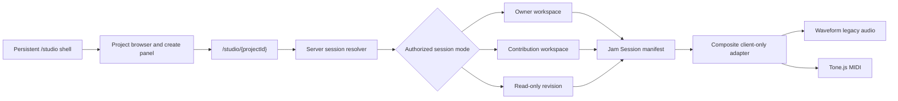

# Studio-forward workspace refactor plan

Status: Repository complete through STUDIO-06 and UX-05; milestone pulse accepted
Prepared: 2026-07-14  
Sequence: MIDI-01–MIDI-07, STUDIO-01–STUDIO-06, and UX-01–UX-05 are repository-complete; hosted capability review and the separately authorized audio lock remain before PR 18

## Executive recommendation

The proposed direction is sound. Jam Session should present the studio as a top-level, persistent workspace that opens, creates, and switches between projects. Projects remain the durable collaboration and history boundary, but they should no longer appear to own a separate studio application.

The target mental model should be:

> Open Jam Session Studio, then choose what music to work on.

This is mostly an information-architecture and application-shell inversion. It should **not** introduce a new database-level `studio` entity, weaken project authorization, or change immutable revision semantics. The existing `projects`, `workspaces`, revisions, contribution workspaces, manifests, RLS, and private source delivery remain the domain authority.

The recommended canonical routes are:

- `/studio` — authenticated studio home with no project loaded;
- `/studio/{projectId}` — the persistent studio shell with one authorized project/session loaded; and
- `/projects/{projectId}/studio` — temporary compatibility redirect to `/studio/{projectId}`.

The proposal is realistic with the current stack. Project loading, creation, switching, vertical track reordering, timeline movement, trimming, copying, looping, splitting, integrated piano-roll editing, and MIDI recording are achievable. Manifest v2 and its normalized projections now provide the multi-clip foundation; UI support still must prove exact workspace/revision/contribution/fork round trips before exposing every operation. Independent playback-speed and pitch controls are a separate DSP problem and should not be promised as part of the structural refactor.

The route-neutral session contract, studio-first project creation flow, manifest-v2 clip shape, future engine-portability rules, and reversible source-admission control were implemented through MIDI-07. STUDIO-01–STUDIO-06 and UX-01–UX-05 now provide the primary creation workflow and usability pass. Admission remains enabled pending the authorized hosted review and separately approved capability transition.

## Roadmap integration

This document no longer describes one large post-MIDI rewrite. Work is divided deliberately:

- **Accepted now:** canonical routes, one-live-project model, start-center behavior, route-neutral session descriptor, manifest-v2 identity/clip shape, and engine-portability boundaries.
- **MIDI-01:** executable contracts and fixtures for the session descriptor, composite capabilities, manifest identity, and stable audio/MIDI clips.
- **MIDI-05:** composite MIDI/audio runtime, normalized clip foundations, and atomic project-plus-empty-workspace creation. The current nested route may remain canonical during MIDI delivery.
- **MIDI-07:** complete; reversible source-admission authority and compatibility behavior are tested while admission remains enabled.
- **STUDIO-01–STUDIO-06 after MIDI-07:** complete; route migration, project browser/switching/creation, unified arrangement layout, clip interactions, Studio-integrated MIDI composition/recording, and repository parity/hardening.
- **UX-01–UX-05:** complete; transport correctness, blank DAW shell, inline track/clip workflows, responsive piano interaction, and block editing.
- **Outside the MVP critical path:** pitch/varispeed/time-stretch spikes and OpenDAW integration.

MIDI-02–MIDI-04 intentionally delivered the editor and recorder as a standalone vertical foundation. That route remains valuable, but the final product experience reuses those components inside Studio instead of requiring a musician to export/import or navigate between unrelated screens for ordinary project work. Splitting the remaining work into six slices keeps shell, arranger, interaction, integrated composition, and release-risk changes independently reviewable.

## Product and architecture alignment

This proposal supports the current PRD rather than changing Jam Session into a professional DAW:

- The PRD already describes an integrated browser workspace for synchronized MIDI and compatible legacy audio.
- The PRD explicitly says Jam Session is not intended to replace Ableton Live, FL Studio, Logic, or Pro Tools.
- The roadmap already plans a Jam Session-owned composite MIDI/audio adapter and manifest v2.
- ADR-003 still applies: mutable private workspaces sit on immutable revision history.
- ADR-004 still applies: the Jam Session manifest, not an editor's live object graph, is the portable authority.
- ADR-006 still applies for the MVP: Waveform Playlist remains the legacy-audio implementation behind the client-only adapter.
- ADR-007 still applies: MIDI is the active prototype creation path after the parity gate, while existing audio history remains supported.

The DAW inspiration should therefore guide hierarchy, speed, keyboard interaction, timeline behavior, and visual density. It should not imply plugin hosting, arbitrary effects graphs, automation lanes, professional time stretching, or proprietary DAW project compatibility.

## Current state and leverage points

The current implementation has several good foundations:

- `/studio` is the authenticated runtime-free start center; `/studio/{projectId}` independently authorizes the viewer, resolves the project/workspace/revision, and then lazy-loads the browser-only studio. `/projects/{projectId}/studio` is redirect-only compatibility.
- `StudioLauncher` and `StudioSurface` already accept distinct revision, owner-workspace, contribution-workspace, and contribution-version modes.
- The adapter is isolated under `src/features/studio/waveform-playlist-adapter`.
- The manifest already persists track order, start position, source trim, duration, gain, pan, mute, and solo.
- Workspace autosave already uses optimistic concurrency and device-local recovery.
- Source loading is manifest-first, cancellable, progressive, actor-scoped, and safe to reuse during the same browser session.
- The current project index RPC is bounded and RLS-scoped, so it can seed a studio project browser.
- The pinned Waveform Playlist engine already contains move, trim, split, collision, snap, and undo/redo primitives; Jam Session currently exposes only part of them.

The main constraints are:

- route ownership and navigation still communicate “a project contains a studio”;
- project creation redirects to the project detail page and does not create an empty editable workspace;
- legacy manifest v1 permits one track per unique asset and one contiguous region, while manifest v2 and normalized clip rows now support bounded clips;
- the current Waveform/composite UI still reads or renders only the first clip in important paths despite the broader v2 persistence contract;
- switching projects is currently a full navigation with no explicit dirty/saving/conflict handoff;
- the studio surface combines loading, transport, mixer, timeline, recovery, publishing, exporting, and contribution context in one large client component; and
- `manifest.workspaceId` is currently checked against `project_id`, so the v1 field name does not describe what it actually identifies.

Before STUDIO-03, the composite surface rendered tracks as stacked forms with numeric start/duration fields and assumed `clips[0]` in key interactions. The unified arranger now presents every audio and MIDI clip on one visual timeline, and STUDIO-04 adds direct validated arrangement mutation without discarding secondary clips. The standalone piano roll still owns the best note-editing experience, so ordinary composition and recording currently pull musicians away from the project context. STUDIO-05 removes that remaining split.

## Target user experience

### Opening the studio

The global authenticated navigation gains a first-class **Studio** destination. Opening `/studio` should render the studio chrome immediately without loading Waveform Playlist, Tone.js, or private audio.

The empty workspace should contain:

- **New project** as the primary action;
- **Open project** with search/filter and a bounded recent list;
- **Continue working** for projects with active owner or contribution workspaces;
- clear read-only labels for projects the viewer can listen to but cannot edit; and
- honest desktop/browser capability messaging before an editing session is selected.

This is a DAW-like start center, not another dashboard. The dashboard remains the cross-product work summary; `/projects` remains the complete project-management index.

### Loading a project

Selecting a project navigates to `/studio/{projectId}` while preserving the `/studio` layout. The URL remains deep-linkable, refresh-safe, and understandable. The studio shell stays mounted; the loaded session subtree is replaced.

The selected project appears in a compact title bar with:

- project title and ownership/contribution context;
- current revision/base state;
- autosave or read-only status;
- a project switcher;
- project details/history link;
- publish or submit action when applicable; and
- an explicit close command that returns to `/studio`.

Do not load more than one active project editor at a time in the first version. “Quickly swap” should mean safe, fast serial switching with recent projects and decoded-source reuse—not multiple live tabs holding several Web Audio graphs and autosave machines in memory.

### Working in the arrangement

The selected project should open as one coherent horizontal arrangement rather than separate audio and MIDI forms:

- one bar/beat ruler, playhead, zoom model, selection model, and transport;
- fixed track headers aligned with scrollable lanes;
- compact track name, preset/instrument, gain, pan, mute, solo, readiness, and reorder controls;
- authorized audio clips rendered with persisted waveform peaks and decoded detail when available;
- MIDI clips rendered with bounded note-density or miniature piano-roll summaries derived from the referenced immutable version;
- a selected track/clip inspector for exact values and keyboard-accessible editing;
- drag and keyboard movement with an explicit grid/snap policy;
- duplicate tracks; copy, paste, trim, loop, and delete clips; and session undo/redo; and
- clear distinction between workspace edits, a private MIDI draft, and immutable published history.

Waveforms are correct for audio. MIDI must not pretend to be audio: its lane visualization should communicate note timing, pitch range, density, clip length, loop state, and preset color without synthesizing or storing a fake waveform. Both clip types still share position, selection, mixer, and transport behavior.

Copying and pasting a MIDI clip or duplicating its complete track reuses exact immutable stem-version references and consumes no new Storage. A duplicated track receives fresh stable track/clip IDs while retaining clip timing, preset, and mixer state. Editing a copy does not mutate the referenced version. The default replacement scope is the selected clip only; replacing every clip that references the old version must be a separate, clearly labelled command. Audio copy/split remains constrained to the same immutable source asset and existing credit/retention boundary.

### Composing and recording MIDI inside Studio

The primary project workflow must not require a trip to a separate page. Opening the piano roll from an inline pending MIDI lane, double-clicking a MIDI clip, or choosing **Edit MIDI part** opens the existing Jam Session editor inside the Studio shell as a docked lower editor or focused workspace panel. The arrangement, transport, track headers, and project context remain visible or immediately recoverable.

The integrated editor reuses—not forks—the components and contracts delivered in MIDI-02–MIDI-04:

- Signal-derived Jam-owned piano-roll geometry and semantic note commands;
- accessible note list/inspector and keyboard equivalents;
- bounded undo/redo and quantize behavior;
- on-screen piano, A–K QWERTY input, and optional permission-gated Web MIDI;
- count-in, metronome, record/stop, stuck-note safety, and local recovery; and
- the same client-only Tone.js audition/recording boundary and immutable preset registry.

For a new part, Studio creates a private stem draft, records or edits relative note timing, and lets the musician audition it against the currently audible arrangement. **Save version and add to arrangement** freezes the first immutable stem version and atomically inserts a track/clip into the optimistic workspace. For an existing clip, Studio derives a private draft from the referenced exact version. **Save new version and replace clip** freezes a successor and atomically updates only the selected clip by default.

Draft autosave and workspace autosave remain separate state machines. A draft may be heard as a session overlay, but mutable draft IDs never enter manifest v2, normalized project clips, revisions, contribution versions, previews, or forks. Publishing/submitting while an integrated draft has uncommitted musical changes must require an explicit choice: finish the new version, discard/close the draft while preserving the last immutable arrangement, or stay in the editor. It must never silently publish an audition overlay.

Recording uses the project transport as context: count-in and metronome follow project tempo/time signature, other unmuted tracks may play, the armed MIDI draft receives the performance, and captured note times are converted to ticks relative to the intended clip start. Recording never mutates an immutable project reference until the musician explicitly freezes and applies the new version.

My stems remains a first-class library for audition, lineage, import/export, direct draft management, and reuse across projects. The standalone editor routes remain deep-linkable and fully functional as an alternate/fallback surface. They share implementation with Studio and must not become a second command model or persisted format.

### Creating a project inside the studio

“New project” should open a studio-owned panel or dialog rather than send the user to a separate product page. The initial form should collect the existing required project metadata, with musician-focused defaults and progressive disclosure for secondary taxonomy.

Creation should atomically produce:

1. the private project and owner membership;
2. the initial empty MIDI-capable workspace/manifest; and
3. the identifiers needed to redirect directly to `/studio/{projectId}`.

This should be a single database command once the MIDI model supports a zero-revision workspace. Avoid a client-orchestrated “create project, then create workspace” sequence that can leave a stranded project when the second operation fails.

The existing `/projects/new` route can remain as an alternate entry and use the same command/form contract. Its successful destination should become `/studio/{projectId}`.

### Switching projects safely

Switching follows an explicit state machine:

1. If the current session is clean or read-only, switch immediately.
2. If edits are pending and online, complete the current optimistic save and require its acknowledgement.
3. If a save is in flight, show “Saving before switching” and disable repeated selection.
4. If the draft is offline, conflicted, or failed, do not silently switch. Offer **Stay here** or **Leave with a recovery copy**, explaining that the device-local copy is not the server authority.
5. Abort outstanding signing/fetch/decode work for the old session.
6. Pause playback, dispose the old adapter/audio graph, and clear session-only mixer state.
7. Navigate to the new canonical studio URL.
8. Prepare placeholder lanes from the new manifest, then progressively attach peaks/audio or MIDI runtime state.

The existing actor-scoped decoded-buffer registry may reuse immutable audio for a second authorized project that references the same asset, but every new session must still be authorized through its own server/RLS path. A cached buffer is a performance aid, never proof of access.

## Proposed route and component structure

```text
src/app/studio/
  layout.tsx                 # authenticated persistent studio shell; no loading.tsx
  page.tsx                   # empty/start-center state
  [projectId]/page.tsx       # server-authorized session resolver

src/app/projects/[projectId]/studio/page.tsx
                              # temporary redirect only

src/features/studio/
  shell/                     # project browser, title bar, create panel, switch coordinator
  session/                   # engine-neutral session descriptor and lifecycle
  arranger/                  # ruler, lanes, clip selection/gestures, inspector, command history
  midi-composer/             # Studio integration of shared piano-roll/recording components
  manifest/                  # all supported manifest schemas and migrations
  waveform-playlist-adapter/ # legacy audio implementation boundary
  midi-adapter/              # planned MIDI implementation boundary or documented successor
```

Do not add `loading.tsx` at `src/app/studio` or its dynamic child while Next.js 16.2.10 is pinned. The repository's documented Firefox development-streaming workaround must move with the canonical studio route and remain until the upstream issue is deliberately revalidated.

The persistent layout should own navigation chrome and lightweight project-list state. The dynamic page should own the authorized session descriptor. The browser editor should remount for each project switch so its audio graph, autosave generation, recovery key, and abort controller cannot leak into the next session.



## Session contract

Replace the route-shaped `StudioLauncherProps` union with a smaller engine-neutral `StudioSessionDescriptor` returned by one server resolver. It should distinguish at least:

| Mode                        | Viewer experience                      | Mutable authority                          | Primary completion action               |
| --------------------------- | -------------------------------------- | ------------------------------------------ | --------------------------------------- |
| Empty                       | Start center                           | None                                       | Create or open project                  |
| Owner workspace             | Editable                               | Active viewer-owned project workspace      | Publish revision                        |
| Contribution workspace      | Editable while draft/changes requested | Active author-owned contribution workspace | Submit contribution                     |
| Member revision             | Read-only                              | Current immutable revision                 | Start/continue contribution if eligible |
| Contribution version review | Read-only comparison/review            | Immutable submitted version                | Review from contribution flow           |

The resolver should continue using verified identity, repositories, database authorization, and RLS. The project picker can hide inaccessible choices for usability, but the selected route must independently authorize the resource.

The descriptor should provide data, capabilities, and canonical links—not infer capabilities in the client from owner IDs or route shape. Example capability flags include `canEdit`, `canPublish`, `canSubmit`, `canStartContribution`, `canDownloadSources`, and `canFork`.

Keep project management and studio session concerns separate:

- Project: metadata, visibility, collaboration settings, membership, license, lineage, current revision.
- Workspace: one viewer's mutable draft based on an exact revision.
- Studio session: ephemeral authorized browser context presenting a workspace or revision.
- Manifest: portable persisted arrangement authority.
- Adapter: runtime implementation of the manifest's supported editing/playback capabilities.

No `studios` table is needed.

## Project browser and recent work

Start with the existing bounded `list_viewer_projects` behavior rather than building a new unbounded client query. Add a studio-specific projection/RPC only if measurements show the existing projection cannot provide the needed fields.

The first project-browser result shape should include:

- project ID/title/status/role and current revision ID;
- active workspace ID, type, base revision, updated time, and conflict/stale indicator when visible to the viewer;
- whether a contribution needs attention;
- compatibility (`midi` or `legacy_hybrid`) after the MIDI migration; and
- a bounded, opaque cursor.

Use server-derived `updated_at` ordering for the initial recent list. Do not add cross-device “last opened” persistence in the first slice. If product evidence later supports it, add a narrow private preference/event with retention and rate limits; do not overload public activity or project `updated_at` merely because someone opened a project.

## Manifest and data-model implications

### Preserve manifest v1

Published manifest-v1 revisions and existing workspaces must remain readable forever under the current compatibility contract. Do not edit or reinterpret old JSON in place.

When manifest v2 is introduced for MIDI, correct the misleading v1 identity name. The new portable document should use `projectId` (or another explicitly documented project identity), not call a project ID `workspaceId`. The actual mutable workspace row ID remains envelope metadata because the same musical document shape is used in immutable revisions and submissions.

### Implemented audio clip foundation

MIDI-01 fixed and MIDI-05/MIDI-06 implemented a manifest-v2 design that discriminates audio and MIDI tracks with stable clips for both kinds. Manifest v1 retains its one-region compatibility shape. The accepted bounded v2 audio shape is:

- an audio track retains one source `assetId`, mixer state, ordering, instrument, and attribution boundary;
- the track owns `clips[]` with stable `clipId`, `positionMs`, `trimStartMs`, and `durationMs`;
- all clips on that initial audio track reference the same immutable source asset;
- clips may not overlap on the same track in the simple studio;
- split produces two adjacent clips referencing the same source bytes;
- trim changes clip source offset/duration and never rewrites the source asset; and
- a v1 track maps deterministically to one v2 audio track containing one clip.

Keeping one source asset per audio track avoids an immediate credit-model expansion: the existing per-track source-credit snapshots remain coherent. Cross-track clip movement or mixing multiple source assets on one track should remain out of scope until attribution, normalized projections, and retention semantics are explicitly designed.

Normalized workspace, revision, and contribution-version clip projections now exist. Save, publish, submit, accept, and fork prove manifest/projection equivalence. Workspace clip rows are replaced only through the optimistic complete-manifest command; revision and contribution-version clip rows are immutable. STUDIO-04 must add UI/adapter round-trip fixtures for each newly exposed operation before enabling it.

ADR-008 records this intentional expansion; no manifest rewrite is required for the Studio UI program.

### Keep mutable MIDI drafts outside project authority

Studio integration does not change the immutable reference rule. A project workspace manifest references only exact `midi_stem_version_id` values. The integrated piano roll edits an owner/author-scoped mutable stem draft using its own optimistic lock and recovery envelope. Session-only audition may overlay draft notes in the browser, but save, publish, submit, preview, acceptance, and fork read only the canonical workspace manifest.

The finalize-and-apply boundary must be one authorized service operation from the user's perspective. It validates the draft and workspace locks, appends the immutable stem version, applies creator/derivation credit, updates the selected workspace clip or inserts the new track/clip, regenerates projections/checksum, and returns both new lock states. The database implementation may compose existing commands only if failure cannot strand a published version that the user reasonably believes was applied; otherwise add one narrow transactional function. Idempotency keys must distinguish first-version add from derived-version replacement.

Do not add mutable draft IDs to manifest v2 merely to simplify UI recovery. If product evidence later requires a durable “draft opened from this clip” convenience link, keep it private, owner/author-scoped, non-authoritative, independently expirable, and absent from immutable copying. It is not required for the first integrated flow because the draft remains recoverable from My stems and the old immutable clip remains valid.

### No schema change for the studio shell itself

The new route, start center, project switcher, and session descriptor should not require a schema migration. Database changes are justified only for:

- atomic project-plus-empty-workspace creation;
- MIDI compatibility/manifest v2 already planned;
- multi-clip normalized projections; or
- later persisted DSP parameters that pass their feasibility gates.

Any new exposed table or RPC requires explicit grants, RLS, actor-matrix tests, generated type updates, and a clean reset. Current Supabase behavior may not automatically expose new SQL-created tables through the Data API, so access grants and RLS must be treated as separate checks.

## DAW-oriented UI structure

The first UI revamp should improve hierarchy without imitating another product's protected visual design.

Recommended regions:

1. **Application/title bar** — Studio, project switcher, project name, save state, project/history link, create/open commands.
2. **Transport bar** — play/pause/stop, position, loop/metronome when supported, tempo/time signature, zoom, follow.
3. **Left browser** — recent projects and, once MIDI exists, available built-in instruments; collapsible to preserve timeline width.
4. **Track headers/channel strips** — selection, drag handle, name, arm where applicable, mute/solo, compact gain/pan, readiness.
5. **Timeline/arrangement** — ruler, playhead, clips, selection, move/trim/split gestures.
6. **Inspector** — selected track/clip properties with precise keyboard-editable values.
7. **Bottom/status area** — autosave, offline/conflict/recovery, source readiness, actionable errors.

Publish, submission, source download, and WAV/MIDI export should move into coherent project/file actions instead of occupying full-width cards beneath the timeline. Destructive or history-changing actions still require clear labels and confirmation proportional to risk.

Continue using the brand's warm studio-night tokens, semantic colors, pill actions, short waveform lanes, and accessible focus treatment. A DAW-like layout can be denser than ordinary product pages, but it must keep keyboard alternatives, readable status, reduced-motion support, and the current desktop capability gate.

## Editing feature feasibility

| Requested capability                               | Feasibility with the pinned stack    | Actual work/risk                                                                                                                                                                                       | Recommendation                                                             |
| -------------------------------------------------- | ------------------------------------ | ------------------------------------------------------------------------------------------------------------------------------------------------------------------------------------------------------ | -------------------------------------------------------------------------- |
| Drag tracks vertically to reorder                  | High                                 | Wire dnd-kit to `reorderTracks`, preserve buttons/keyboard alternative, autosave one canonical order                                                                                                   | Implement in first DAW interaction slice                                   |
| Move audio forward/back on timeline                | High                                 | Enable Waveform Playlist clip interaction, snap policy, propagate `onTracksChange`, test placeholder/decoded parity                                                                                    | Implement with drag plus numeric inspector                                 |
| Trim clip edges                                    | High                                 | Library already models offset/duration and boundary constraints; Jam manifest already has one trim range                                                                                               | Implement for the existing single clip, then preserve under v2 clips       |
| Split audio                                        | Technically high, integration medium | Library engine and v2 projections support clips; the Jam adapter/UI must stop discarding secondary clips and prove all immutable collaboration round trips                                             | Implement in STUDIO-04 after exact adapter/projection fixtures pass        |
| Undo/redo                                          | High for session state               | Waveform engine supports transaction history; must integrate with autosave/recovery and not imply revision-history undo                                                                                | Add with move/trim/split, session-local only                               |
| Render MIDI clip summaries                         | High                                 | Resolve bounded immutable note events already needed for playback; derive viewport summaries without persisting fake waveforms                                                                         | Render note-density/piano-roll thumbnails in the shared lane               |
| Copy/paste MIDI clips or duplicate MIDI tracks     | High                                 | Reuse exact immutable version IDs; define selected-clip replacement scope, fresh stable IDs, collision/snap behavior, and bounded clipboard data                                                       | Implement in core clip-interaction slice                                   |
| Compose/record MIDI within Studio                  | High with existing foundation        | Reuse piano roll/recorder, coordinate project transport and draft/workspace locks, keep audition overlays out of manifests, and make finalization/application atomic                                   | Required before the Studio parity gate                                     |
| Simple per-track varispeed that also changes pitch | Medium                               | Current public multitrack adapter does not expose it; custom playout scheduling, waveform duration, seeking, export, and persistence all change                                                        | Spike only; label honestly as coupled speed/pitch if adopted               |
| Speed change while preserving pitch                | Low-to-medium                        | The pinned single-track MediaElement mode supports pitch-preserving rate, but the multitrack Tone playout does not expose equivalent per-track stretching; robust time stretching needs additional DSP | Defer unless a measured DSP spike meets quality/CPU/export gates           |
| Pitch shift while preserving duration              | Medium                               | Tone.js contains `PitchShift`, but Jam Session does not currently persist/apply it; latency, artifacts, CPU, browser variance, and offline export need proof                                           | Run a narrow semitone-based per-track spike; do not promise production yet |

### What Waveform Playlist can realistically do

The pinned `@waveform-playlist/browser@15.3.4` and engine packages already expose clip dragging, boundary trimming, splitting, collision constraints, snapping, and undo/redo. The upstream project also documents multiple clips per track with drag-to-move and trim, and its engine exposes `moveClip`, `trimClip`, and `splitClip` operations.

Jam Session's current Waveform/composite presentation still maps important paths to `clips[0]`. That is why split is not merely a button addition: manifest v2 and database projections can preserve the second clip, but the adapter/UI must hydrate, edit, play, and export every clip without discarding it. STUDIO-04 owns that proof.

### Playback speed

“Playback speed of a track” needs a product definition before implementation:

- **Varispeed:** faster/shorter/higher pitch or slower/longer/lower pitch. This follows native buffer playback behavior and is the more feasible option, but the multitrack Waveform Playlist public adapter still needs extension.
- **Time stretch:** faster/slower while pitch remains stable. This is what many users will expect from a modern DAW. It is substantially harder and is not provided by the pinned multitrack playout path.
- **Global audition speed:** the whole project changes speed together. This is different from transforming one track and may be useful for practice/review, but it should normally be session-only and not alter the arrangement.

Do not expose a control called simply “Speed” until the chosen behavior, waveform/timeline duration, export result, and collaboration persistence are defined.

### Pitch

Tone.js offers a near-real-time pitch-shift effect measured in semitones. This makes a bounded per-track pitch control plausible, but not automatically production-ready. The feasibility spike must test:

- vocals, drums, bass, and harmonic material at small and large intervals;
- added latency and transport alignment;
- CPU/memory with the project track ceiling;
- Safari, Firefox, Chrome, and Edge behavior;
- live playback versus offline WAV export equivalence;
- save/reload determinism and exact engine-version compatibility;
- contribution/revision/fork round trips; and
- accessible bypass/reset and clear semitone labels.

If the quality gate fails, pitch should remain deferred to OpenDAW or a later dedicated DSP decision. Avoid adding a heavy time-stretch/pitch dependency merely to check a roadmap box.

## Future OpenDAW compatibility

The proposed studio shell should be engine-neutral now, but it should not implement engine selection, premium entitlements, or OpenDAW code during this work.

The future direction is plausible if the contracts stay asymmetric:

- **Simple/Waveform to OpenDAW:** import the Jam Session manifest subset—tempo, time signature, track order, source clips, MIDI notes/clips, gain/pan/mute, and supported attribution—into a newly created OpenDAW session.
- **OpenDAW to Simple/Waveform:** reject as a project conversion. Offer rendered stems and/or bounded MIDI export as an explicit lossy workflow only if licensing, storage, credits, and source-admission policy later allow it.

Do not make `engine = waveform-playlist` the conceptual owner of the shared project format. Manifest v2 should identify the Jam Session format/capability version, while adapter-specific compatibility metadata remains explicit. A future user preference can choose which capable adapter opens a compatible project; it must not rewrite immutable history merely because the preferred editor changed.

OpenDAW currently advertises an SDK and is licensed under AGPL-3.0. Jam Session's existing architecture correctly requires a separate licensing/hosting review and superseding ADR before integration. A commercial “premium” offering may need a commercial license or a deliberately AGPL-compliant deployment model; this is a legal/product gate, not just an engineering toggle.

## Recommended delivery sequence

### Decision checkpoint — complete before MIDI-01

The tracked PRD, roadmap, technical design, ADR-008, and this plan now accept:

- top-level `/studio` and `/studio/{projectId}` routes;
- a route-neutral `StudioSessionDescriptor`;
- atomic MIDI project-plus-empty-workspace creation;
- corrected manifest-v2 project identity naming;
- stable audio and MIDI clip identities in manifest v2 while preserving the v1 parser; and
- OpenDAW as a future adapter/import target only, with no entitlement schema.

### MIDI-01 prerequisite — contracts and fixtures

MIDI-01 freezes and proves, but does not migrate production routes:

- the authorized session descriptor and capability matrix;
- composite adapter/controller responsibilities and disposal contract;
- manifest-v2 project identity, audio/MIDI track union, and stable clip shape;
- deterministic v1 audio-track to v2 single-audio-clip mapping;
- the one-source-asset-per-audio-track attribution boundary; and
- server/client dependency-graph fixtures.

### MIDI-05 prerequisite — runtime and persistence foundation

MIDI-05 implements the pieces required by both MIDI publication and the later Studio shell:

- the composite MIDI/audio adapter and route-neutral session resolver;
- normalized workspace, revision, and contribution clip projections completed through MIDI-06;
- exact save/publish v2 manifest/projection validation;
- atomic project, owner membership, and empty MIDI workspace creation; and
- MIDI import/preview/export while preserving the current nested Studio route until STUDIO-01.

### STUDIO-01 — Canonical shell and route migration

Outcome: an authenticated user can open a project-independent Studio start center, and all existing studio links resolve to the new canonical route.

Scope:

- add the persistent `/studio` layout and empty page;
- add `/studio/{projectId}` using the existing server authorization and launcher behavior;
- redirect the old nested route;
- add top-level Studio navigation and change project CTAs to “Open in studio”;
- preserve browser-only lazy loading and the Firefox `loading.tsx` exception; and
- add route, auth, not-found, redirect, and no-editor-on-empty-page tests.

Do not change manifests or database behavior in this slice.

### STUDIO-02 — Project browser and safe switching

Outcome: users can create, load, close, and switch among authorized recent projects without losing an acknowledged draft.

Status: Complete. The shell uses the existing bounded project cursor plus a viewer-scoped active-workspace projection; creation reuses `ProjectForm`, `createProjectAction`, and `create_midi_project_workspace`. A forward-only repair aligns nullable form descriptions with the command and makes exact project-creation retries compare every normalized input before returning the existing project. Selected sessions expose a minimal generation-aware save/recovery/disposal port through `MutableStudioLifecycle`; `coordinateStudioExit` serializes switch and close intents, while Studio creation uses the same save/recovery gate before invoking the shared atomic action. Shell regions are the persistent header actions plus modal project-browser, creator, and recovery-decision panels.

Scope:

- bounded project picker with role/workspace/read-only state;
- canonical navigation and recent selection;
- save-before-switch coordinator;
- conflict/offline/recovery decision UI;
- abort/dispose lifecycle and playback stop;
- decoded-source reuse only after new-session authorization;
- shared project form contract in a studio panel/dialog;
- reuse the MIDI-05 atomic project, membership, and empty-workspace command;
- idempotency and RLS actor matrix;
- direct transition to `/studio/{projectId}`;
- make `/projects/new` reuse the same behavior; and
- E2E coverage for creation retry plus clean, dirty, saving, conflict, unauthorized, and source-loading switches.

### STUDIO-03 — Unified arranger layout and visualization

Outcome: MIDI and compatible legacy audio appear in one coherent, credible arrangement workspace instead of stacked configuration forms.

Scope:

- extract the current composite surface into session, transport, arranger, mixer, inspector, action, and status responsibilities;
- render a shared bar/beat ruler, playhead, zoom/follow state, scroll synchronization, and selected track/clip model;
- render fixed channel headers with name, preset/instrument, compact gain/pan, mute/solo, readiness, and accessible reorder controls;
- render audio lanes from authorized persisted peaks with decoded-detail enhancement;
- render MIDI lanes as bounded note-density/piano-roll summaries from immutable notes, with preset/loop/credit context and no fake waveform persistence;
- keep form-grade exact values in the selected inspector rather than using them as the primary arrangement UI;
- place add/import, publish/submit, download, and export actions in coherent Studio menus/panels;
- preserve current save/publish/playback behavior while changing presentation;
- support declared desktop widths, reduced motion, visible focus, screen-reader lane summaries, and keyboard selection; and
- add component/visual/browser coverage for empty, loading, failed, audio-only, MIDI-only, mixed, owner, contributor, and read-only sessions.

Non-goals: pointer clip mutation, integrated note editing/recording, route switching changes, or new persisted fields. Those belong to the following slices.

### STUDIO-04 — Core arrangement interactions

Outcome: musicians manipulate tracks and clips directly on the timeline with accessible, deterministic alternatives, and the resulting arrangement survives every immutable collaboration boundary.

Scope:

- vertical drag reorder plus keyboard up/down commands;
- clip selection, horizontal move, grid snapping with a modifier/explicit no-snap path, and inspector fallback;
- MIDI track duplication plus clip copy, paste, delete, trim/source offset, duration, and loop interactions with stable new IDs;
- audio move/trim and duplicate/split only within the same immutable source-asset track and only after projection round-trip fixtures pass;
- an explicit compatible-target rule for cross-track operations; do not silently change source ownership or MIDI preset semantics;
- selected-clip-only MIDI version replacement by default, with any “replace all references” command separately confirmed;
- bounded session command history for undo/redo integrated with workspace autosave generation and local recovery;
- collision, project-boundary, note/source-boundary, maximum-clip, and maximum-duration guards;
- exact manifest/projection checksum validation across save, publish, submit, review, accept, and fork;
- mixed audio/MIDI keyboard and pointer parity; and
- focused unit, database, and browser round trips that reload the exact edited arrangement.

Non-goals: editing immutable MIDI notes in place, arbitrary cross-asset audio lanes, automatic musical merge, or persistent clipboard history.

Implemented: one deterministic manifest-v2 command boundary now validates compatible targets, source/project/collision/capacity bounds, fresh clip IDs, selected-clip version replacement, and canonical ordering. The arranger maps pointer release, keyboard shortcuts, explicit reorder controls, snap/no-snap, and exact inspector edits into that boundary; a bounded grouped session history feeds the existing recovery generation and debounced optimistic save. Waveform adapter fixtures reject dropped secondary audio clips, while mixed pgTAP fixtures prove multi-clip MIDI/audio state across workspace branching, publish/submit, accept, and fork projections. No schema or RPC change was required, and source admission remains enabled.

### STUDIO-05 — Integrated MIDI composition and recording

Outcome: a musician creates, edits, and records a MIDI part in project context, freezes an immutable version, and adds or replaces the selected arrangement clip without leaving Studio.

Scope:

- embed the shared Jam-owned piano roll as a docked lower editor or focused Studio panel; do not copy/fork its command model;
- open it from the inline pending MIDI lane, MIDI clip double-click/Enter, and **Edit MIDI part**;
- support blank drafts, local `.mid` import, and derivation from the selected exact stem version;
- reuse note create/move/resize/duplicate/delete/velocity/quantize, note inspector, keyboard shortcuts, and draft recovery;
- use project tempo/time signature and transport context for count-in, metronome, playhead, audition, and recording against other audible tracks;
- reuse on-screen/QWERTY input and optional gesture-gated Web MIDI without persisting device identity;
- keep draft autosave and workspace autosave separate and visibly labelled;
- treat draft playback as a session audition overlay only; never serialize a draft ID or overlay notes into the project manifest;
- implement idempotent **Save version and add to arrangement** and **Save new version and replace clip** boundaries with draft/workspace optimistic locks, immutable credits/lineage, and atomic user-visible outcome;
- default replacement to one selected clip and leave every published/referenced older version intact;
- block or explicitly resolve publish/submit while the open integrated draft contains unapplied changes;
- preserve `/stems`, direct editor routes, My stems audition/lineage/import/export, and accessible standalone fallback using the same components; and
- cover refresh, conflict, offline, failed finalization, route switch, focus loss, stuck-note prevention, contribution-author, and owner flows.

Non-goals: draft IDs in manifests, automatic version creation on every autosave, note-level collaboration merge, audio recording, or simultaneous editing of several MIDI drafts.

Implemented: the shared editor now accepts a narrow Studio host for project tempo/meter, transport audition, draft-state reporting, and explicit finalize behavior while standalone routes retain the same component and default publication path. Studio opens blank/imported or exact-version-derived private drafts from arrangement affordances; draft and workspace autosave/recovery remain independent. `finalize_studio_midi_draft(...)` records replay-bound intent, publishes the acknowledged draft, transforms only the requested new track or selected clip in the authoritative v2 manifest, and reuses canonical workspace projection/save validation in one transaction. Publication is disabled while the integrated draft is open, exit disposal stops transport/listeners and retains eligible recovery, and source admission remains enabled.

### STUDIO-06 — Parity, hardening, audio-lock enablement, and compatibility handoff

Outcome: Studio replaces the old mental model as the complete prototype creation path, and new source admission is disabled only after that path is proven usable.

Scope:

- complete Studio-native E2E from project creation through MIDI composition/recording, arrangement, mix, save/reload, publish, preview, contribution, acceptance, fork, and export;
- run standalone-editor compatibility and every retained legacy-audio playback/download/export/publish/fork regression;
- verify old-client/direct-RPC source-admission bypass denial while the capability is disabled in test;
- measure arranger startup, 8-track/2,000-note interaction, scheduling, recording, repeated project switching, and long-session disposal budgets;
- complete keyboard, screen-reader, reduced-motion, contrast, supported-browser, Web MIDI fallback, and Firefox route regression checks;
- verify signed URL refresh, draft/workspace conflict recovery, deep links, contribution review, and session disposal;
- enable the trusted source-admission lock only after the preceding parity evidence is accepted, using the documented hosted enable/rollback order;
- replace upload affordances with accurate prototype-unavailable copy only when the authoritative lock is enabled;
- retain the compatibility redirect unless evidence justifies removal; keeping it indefinitely is acceptable if it remains cheap and tested; and
- update PRD, roadmap, architecture, brand implementation map, README, agent/testing guidance, and PR 18 handoff.

Implemented in the repository: the complete Studio-native create-to-export path and retained collaboration/legacy paths are exercised locally; exact referenced MIDI data is loaded through existing RLS for read-only revision and contribution playback; lifecycle registration is optional for compatible surfaces outside the canonical shell; repeated switching and disabled-admission rollback are covered. Performance results and remaining manual/hosted gates are recorded in the STUDIO-06 evidence. No hosted mutation was authorized, so source admission remains enabled and PR 18 must begin from that recorded capability state unless an operator completes the runbook first.

### UX-03 usability outcome — inline tracks and clip containers

Implemented: the unified arranger pins an Add a track row below the channels and represents its one named empty MIDI lane only in selected-session UI state. Blank piano-roll and validated local `.mid` entry create private drafts directly; the existing replay-safe finalization transaction alone freezes a version and materializes the pending track/clip, after which Studio closes the editor, selects the clip, and restores lane focus. MIDI Copy/Paste adds clips at the playhead or next opening, Duplicate clones the complete MIDI track into a new lane with fresh stable IDs, and semantic move/copy accepts compatible MIDI destinations in both axes while retaining exact immutable version IDs and credit lineage. Moving a non-overlapping clip may extend the timeline, so silence between clips is preserved; audio remains same-asset only. No manifest, schema, RPC, or source-admission change was required.

### UX-04 usability outcome — responsive piano interaction

Implemented: the one shared standalone/integrated MIDI editor renders semantic layered white/black key depth, labels only C rows for melodic presets and named rows for drum maps, and centers clamped middle C on its first measured viewport without taking authority from later scrolling. A source-aware transient active-pitch union connects performance-key pointer input, QWERTY, Web MIDI, gutter audition, and bounded editor previews to matching canvas and `aria-pressed` feedback. Pointer capture turns the gutter into a glissando surface, while the performance strip tracks one held pointer across its keys; both switch each crossed pitch once and release on exit, up, cancel, blur, disconnect, stop, and disposal. The state is session-only and required no manifest, schema, RPC, authorization, or source-admission change.

### UX-05 usability outcome — marquee selection and block editing

Implemented: the shared editor exposes explicit Pencil and Select tools with pressed state, help, and P/V shortcuts. Select-mode drags create transient tick/pitch rectangles and choose notes by musical intersection; Shift toggles the intersected set, Escape or an empty click clears it, and the synchronized note list/inspector remain the accessible authority. Dragging any selected note emits one snapped semantic `moveNotes` edit and auditions the grabbed note as the block changes pitch; Alt uses exact integer ticks, and Ctrl/Cmd-drag creates fresh IDs and positions the copies in one history step. Ctrl/Cmd+C/V and Duplicate use the same bounded semantic duplication boundary. Pointer cancellation discards previews, while completed gestures create one autosave/history generation. No selection, rectangle, clipboard, preview, schema, RPC, authorization, manifest, or source-admission state changed.

### Post-MVP DSP research — not sequenced delivery

Pitch shift, coupled varispeed, and pitch-preserving time stretch remain separate evidence spikes. Each must end in adopt/defer/reject. Only an adopted behavior receives a versioned manifest field, normalized projection if queryable, adapter fixtures, publish/submission/accept/fork coverage, and user-facing controls. None blocks STUDIO-04, PR 18, or the invited MVP.

## Testing and evidence plan

### Unit/contract

- session-descriptor parsing and capability mapping;
- switch state machine for clean/dirty/saving/offline/conflict/error cases;
- v1-to-v2 manifest migration and deterministic canonical serialization;
- multiple audio-clip mapping and collision/trim/split boundaries;
- MIDI clip summary projection, stable-ID copy/paste, selected-only replacement, and project-boundary guards;
- undo/redo command grouping;
- integrated draft audition versus immutable workspace authority and finalize/apply idempotency;
- project-transport-to-relative-stem recording tick conversion;
- pitch/rate parameter bounds only if adopted; and
- engine hydration/export round trips for every supported manifest version.

### Database/RLS

- anonymous, owner, unrelated authenticated user, member/contributor, reviewer, and suspended actor paths;
- atomic create retries and conflicting idempotency reuse;
- one active viewer workspace per project;
- complete-manifest clip projection equivalence;
- immutable revision/submission clip rows;
- acceptance and fork exact copying without source duplication;
- source retention and credits after split; and
- old-client rejection of unsupported manifest/DSP fields.
- transactional stem-version finalize plus workspace clip add/replace, including stale draft, stale workspace, retry, and unrelated-actor paths;

### Browser/E2E

- `/studio` loads without editor/audio chunks or private-source requests;
- open owner workspace, read-only member revision, and contribution workspace;
- create project in Studio and edit immediately;
- switch while clean, dirty, saving, loading audio, offline, and conflicted;
- old nested URL redirect;
- drag reorder and keyboard reorder;
- drag move, precise inspector move, trim, split, undo, redo, save, reload, publish;
- open the integrated piano roll, create/derive a draft, record against audible project tracks, freeze/apply it, and reopen the exact arrangement;
- prevent publish/submit from silently omitting an open unapplied draft;
- retain standalone My stems/editor deep links and recovery;
- submit/review/accept/fork multi-clip state;
- expired signed URL during a long session;
- Firefox navigation regression with no route-level loading boundary; and
- MIDI and legacy-audio regression journeys.

### Performance

Measure separately:

- Studio start-center shell-ready time and JavaScript bytes;
- project-picker query time and result bound;
- project switch to manifest shell, peaks, and playback readiness;
- decoded buffer reuse versus unauthorized cache miss;
- disposal/memory after repeated switches;
- drag/zoom frame behavior at 12 audio tracks and the planned MIDI note ceiling; and
- DSP CPU, latency, glitches, and offline export time if a DSP feature is adopted.

## Important risks and mitigations

| Risk                                                               | Mitigation                                                                                           |
| ------------------------------------------------------------------ | ---------------------------------------------------------------------------------------------------- |
| “Persistent studio” accidentally keeps multiple audio graphs alive | Persist only the lightweight shell; remount and dispose the selected session subtree                 |
| Switching loses an unacknowledged draft                            | Explicit save/switch state machine and existing device-local recovery                                |
| Project picker becomes an authorization boundary                   | Re-authorize the canonical selected route and rely on RLS/service checks                             |
| MIDI work hard-codes old project route assumptions                 | Decide a route-neutral session descriptor before MIDI-01/MIDI-02                                     |
| Integrated editing creates two competing authorities               | Draft autosaves separately; only an explicit immutable finalize/apply command changes the manifest   |
| A failed two-step finalize strands a version or surprises the user | Make finalization and workspace application one idempotent user-visible transaction                  |
| Copy/edit silently changes every reused MIDI clip                  | New clip IDs on copy; replacement targets the selected clip unless “replace all” is explicit         |
| Split silently loses regions                                       | Do not expose split until adapter/UI and immutable round trips preserve every v2 projected clip      |
| Multi-asset tracks complicate credits/retention                    | Initially keep one immutable source asset per audio track                                            |
| DAW styling expands into DAW parity                                | Preserve PRD non-goals and promote only collaboration-relevant controls                              |
| Per-track speed drifts out of sync or changes pitch unexpectedly   | Define varispeed vs time stretch explicitly and gate with evidence                                   |
| Pitch sounds poor or breaks export                                 | Adopt only after multi-browser/live/offline quality evidence                                         |
| Future OpenDAW preference rewrites project history                 | Treat preference as adapter selection; retain Jam Session manifest authority and immutable revisions |
| OpenDAW licensing conflicts with a premium SaaS model              | Separate ADR plus qualified AGPL/commercial-license review before integration                        |

## Resolved product decisions

1. `/studio/{projectId}` is the canonical selected-project deep link and `/studio` is the empty start center.
2. Studio initially opens the start center unless the user follows an intentional project deep link; no cross-device “last opened” state is added.
3. One live project/editor graph at a time is sufficient for the MVP.
4. Studio-owned creation preserves required license/context while progressively disclosing secondary genre/tag/description fields, and it uses one atomic project-plus-empty-workspace command.
5. Manifest v2 defines stable clip identities for both audio and MIDI before the schema is frozen. Audio split UI ships only after normalized round-trip validation.
6. Pitch, coupled varispeed, and pitch-preserving time stretch are not promised by the MVP and do not block the Studio program.
7. Any future saved DSP property requires a separate adopt/defer/reject spike and a versioned persistence/export decision.
8. Studio is the primary MIDI creation surface; standalone My stems/editor routes remain supported alternate/library surfaces built from the same components.
9. Mutable stem drafts remain outside manifests. Draft autosave cannot change a project until an explicit immutable finalize-and-apply command succeeds.
10. MIDI-07 prepares the source-admission capability but does not enable the lock. STUDIO-06 owns the final Studio-native parity decision and enablement.

## Explicit non-goals for this refactor

- OpenDAW integration, SDK installation, or engine preference UI;
- premium plans, payments, entitlements, or storage tiers;
- automatic conversion of OpenDAW projects to the simple studio;
- real-time collaborative editing;
- arbitrary effects racks, plugins, automation, audio recording, or professional warping;
- simultaneous editing of multiple MIDI drafts or automatic draft-to-project publication;
- multiple simultaneous live studio tabs inside one page;
- changes to immutable history, contribution acceptance, or fork semantics;
- public source-audio access or broader service-role usage; and
- rewriting existing manifest-v1 revisions.

## Definition of done

The studio-forward program is complete when:

- `/studio` is a useful authenticated workspace without a selected project;
- users can create, open, close, and safely switch projects from inside Studio;
- canonical deep links refresh correctly and the old route remains compatible;
- owner, contribution, and read-only session modes remain correctly authorized;
- no acknowledged workspace edit is lost during switching or failure;
- the editor/audio runtime remains lazy and client-only;
- DAW-like layout and core timeline interactions are keyboard-usable;
- audio lanes show real waveform information and MIDI lanes show useful note summaries in the same aligned timeline;
- musicians can create, draw, record, edit, freeze, and arrange MIDI in Studio without navigating to the standalone editor;
- draft recovery, immutable version creation, and workspace application remain explicit and conflict-safe;
- split/trim/move/reorder state survives save, publish, contribution, acceptance, and fork when those features are enabled;
- existing v1 audio history and all MIDI journeys continue to work;
- pitch/speed are either evidence-backed and versioned or explicitly deferred;
- the audio-admission lock is enabled only after the complete Studio-native parity evidence is accepted; and
- authoritative product, roadmap, architecture, brand, setup, and test documentation matches the shipped routes and behavior.

## Sources consulted

Repository sources of truth:

- [`docs/PRD.md`](PRD.md)
- [`docs/ROADMAP.md`](ROADMAP.md)
- [`docs/technical-design/01-system-architecture.md`](technical-design/01-system-architecture.md)
- [`docs/technical-design/02-data-model.md`](technical-design/02-data-model.md)
- [`docs/technical-design/03-delivery-plan.md`](technical-design/03-delivery-plan.md)
- [`docs/technical-design/decisions/README.md`](technical-design/decisions/README.md)
- [`docs/design/brand.md`](design/brand.md)
- the current studio route, manifest, adapter mapping, workspace repository, project creation action, and Waveform studio surface
- exact installed package declarations for `@waveform-playlist/browser@15.3.4`, `@waveform-playlist/engine@13.5.1`, `@waveform-playlist/playout@12.5.4`, and `tone@15.1.22`

External primary sources, checked 2026-07-14:

- [Waveform Playlist repository and feature documentation](https://github.com/naomiaro/waveform-playlist)
- [Waveform Playlist multi-clip example](https://naomiaro.github.io/waveform-playlist/examples/multi-clip/)
- [OpenDAW official site and SDK/licensing overview](https://opendaw.org/)
- [OpenDAW official contribution/licensing page](https://opendaw.org/contribute)
