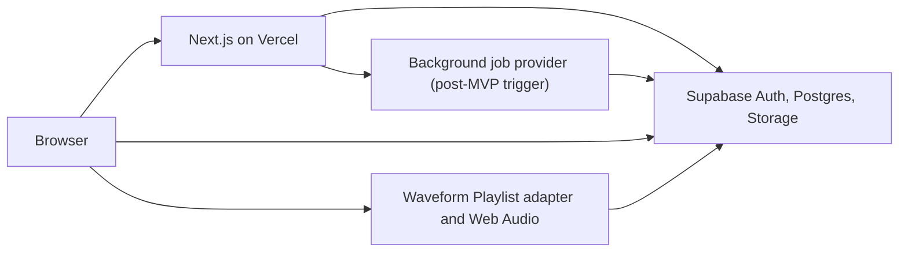

# System Architecture

Status: Proposed  
Audience: engineers and coding agents

## Context

Jam Session combines a conventional web product (identity, profiles, discovery, review workflows) with a browser audio application. These workloads need different rendering and state-management strategies but should share one product shell and authorization model.

## Container view



### Browser

- Receives Server Component HTML for public and authenticated product pages.
- Uses Client Components only for interactive islands.
- Loads the studio via `dynamic(..., { ssr: false })` after an explicit user action.
- Runs Waveform Playlist, Web Audio, waveform work and local draft caching.
- Uploads large files directly to Supabase Storage using a short-lived authenticated session or signed upload flow. Audio bytes must not transit a Vercel Function.

### Next.js application

- App Router, TypeScript strict mode and Node runtime by default.
- Server Components perform reads where streaming/SEO helps.
- Server Actions handle small same-origin mutations; Route Handlers handle resumable upload coordination, callbacks and stable API endpoints.
- The application service layer owns multi-table workflows such as publish, submit, accept and fork.
- Middleware/proxy only refreshes auth cookies and performs optimistic redirects. It is not an authorization boundary.

### Product shell and navigation

- The root layout owns one skip link, persistent header, and footer so public, Auth, profile, project, upload, revision, and studio routes share navigable product chrome.
- The header exposes only implemented top-level destinations: home through the brand link, new project, uploads, and a sign-in/account action. Project-specific edit, publish, and studio links remain contextual to the project page.
- Public HTML renders a complete signed-out shell without a server-side Auth dependency. A small Client Component listens for Supabase Auth changes and route transitions, calls `getClaims()` to verify identity, and progressively replaces sign-in links with account or create-project destinations.
- This Auth-aware display is convenience only. Server Components, server actions, Route Handlers, database commands, and RLS independently authorize every protected destination.
- Navigation and landing-page actions must remain keyboard accessible at the 320 px minimum layout. Primary mint-accent actions use a dark foreground with WCAG 2.2 AA contrast; do not reintroduce white text on the light accent.

### Supabase

- Auth: Google OIDC identities; `auth.users` is private identity authority. Additional providers are post-MVP.
- Postgres: domain state, relationships, search metadata and authorization policies.
- Storage: immutable source audio, revision workspace snapshots, artwork/avatars and derived previews.
- RLS: final enforcement for browser-accessible data.

## Rendering and route map

| Route                                 | Rendering                         | Notes                                                       |
| ------------------------------------- | --------------------------------- | ----------------------------------------------------------- |
| `/` and `/explore`                    | Server-rendered, cached briefly   | Public discovery; query parameters form the filter contract |
| `/@{username}`                        | Server-rendered                   | Canonical profile display uses `@`; database stores no `@`  |
| `/projects/{projectId}`               | Authenticated Server Component    | Private metadata, current revision and explicit studio link |
| `/projects/{projectId}/studio`        | Server shell + lazy client studio | Editor/Tone/browser audio load only after explicit open     |
| `/projects/{projectId}/contributions` | Authenticated server page         | Owner review queue or contributor-owned submissions         |
| `/auth/callback`                      | Route Handler                     | Exchanges OAuth code and redirects to onboarding if needed  |

Use stable opaque IDs in project URLs for MVP. Human-readable slugs can be added later without changing identity.

## Authentication and onboarding

1. Supabase completes OAuth and establishes a cookie-backed SSR session.
2. A database trigger creates an incomplete `profiles` row keyed by `auth.users.id`. Username, display name, credit name and completion time remain null; provider metadata is never trusted as public identity.
3. A new user is redirected to onboarding. Username may be claimed first through the atomic `claim_username()` command, but the row remains incomplete until display name, credit name and the completion timestamp are set together by the onboarding command introduced with the authentication UI.
4. Username claim is a single database function/transaction backed by a unique normalized index and reserved-name policy.
5. Server code obtains the user with a verified Supabase auth call and relies on RLS plus explicit service authorization.

Only completed, active rows from the safe public-profile projection become `PublicUser` values. Database onboarding fields are nullable; the public domain shape is deliberately non-nullable. Email does not belong in the public profile table or public `User` DTO. Avatar persistence is deferred until the asset pipeline can enforce image ownership and integrity, so clients use a deterministic placeholder meanwhile. Define two eventual shapes:

```ts
type PublicUser = {
  id: string;
  username: string;
  displayName: string;
  creditName: string;
  avatarUrl: string | null;
  bio: string | null;
};

type Viewer = PublicUser & {
  email: string | null;
  status: "active" | "suspended" | "deleted";
  lastActiveAt: string | null;
};
```

Dates crossing a network or Server/Client Component boundary are ISO 8601 strings, not JavaScript `Date` instances. Render handles as `@${username}`. Accept either `name` or `@name` in search input, stripping the leading `@` before normalization.

## Core workflows

### Create and publish

1. Create a private project and owner membership.
2. Create a workspace draft based on no revision or the current revision.
3. Client validates and uploads source audio to an immutable asset path.
4. Client saves the versioned Jam Session workspace manifest exported through the studio adapter.
5. `publish_project_revision()` locks the project and usage projection, canonicalizes and checksums manifest v1, verifies trusted-ready owned assets and active instruments, creates immutable revision, track and reference rows, enforces unique retained project bytes, advances `projects.current_revision_id`, and writes a bounded activity event atomically. First publish changes a private project from draft to active without opening contributions.

PR 10 implements steps 2–4 for project owners. Workspace creation copies the exact current immutable revision into a private draft. Every save submits the expected `lock_version`; the database locks the workspace, rejects stale writers, validates the complete manifest and referenced trusted-ready assets, replaces the normalized workspace-track projection, records an immutable private recovery snapshot, and increments the version atomically. Autosave never advances `projects.current_revision_id` or changes a published revision.

PR 11 completes owner publication with `publish_workspace_revision()`. The wrapper locks the project and workspace in a fixed order, reads only the authoritative saved manifest, calls `publish_project_revision()` in the same transaction, then advances the active workspace base and lock. A stale base cannot publish; the explicit restart command archives the stale draft and clones the current revision without merging. Stem export returns short-lived download-disposition URLs so bytes travel from private Supabase Storage to the browser rather than through Next.js. WAV mix export stays inside the lazy client adapter and is bounded to ten minutes and an estimated 128 MiB output.

### Submit a contribution

1. Contributor creates a workspace based on revision `R`.
2. Saving is private and may overwrite the draft snapshot.
3. Submission freezes the draft into proposed revision `C`, records `base_revision_id = R`, and changes contribution state from `draft` to `submitted`.
4. Subsequent changes require a new contribution revision; submitted bytes are not overwritten.

### Accept a contribution

1. Lock the contribution and target project.
2. Verify reviewer ownership, status `submitted`, and base revision.
3. If the project has advanced, mark the contribution `changes_requested` with reason `base_outdated`; do not attempt an automatic audio merge in MVP.
4. Otherwise copy the proposed snapshot references into a new project revision, record `accepted_contribution_id`, advance the current revision, and mark the contribution accepted in one transaction.
5. Attribution is computed from immutable asset ownership and contribution authorship, not free-text credits alone.

### Fork

Forking is metadata-copy-on-write, not file duplication. The new project and first revision reference existing immutable assets, subject to license and visibility checks. `source_project_id` and `source_revision_id` preserve lineage. Deleting the source project must not break an authorized fork; asset retention uses references rather than owner paths.

## Browser studio integration boundary

### Decision

Create a Jam Session `StudioAdapter` interface and one `WaveformPlaylistStudioAdapter` implementation. Pin exact Waveform Playlist packages and any direct Tone.js dependency. Never persist live editor objects or decoded `AudioBuffer` instances.

```ts
interface StudioAdapter {
  load(input: StudioLoadInput): Promise<void>;
  addAudioAsset(asset: SignedAudioAsset): Promise<TrackRef>;
  exportManifest(): Promise<WorkspaceManifest>;
  renderPreview(options: PreviewOptions): Promise<Blob>;
  dispose(): Promise<void>;
}
```

Persist a versioned **Jam Session manifest** containing asset IDs, stable track IDs, positions, trims, labels, gain, pan, mute/solo, order and basic tempo metadata. It is the authoritative collaboration subset, supports server validation and migrations, and prevents the editor library from becoming the data model. Each saved workspace records `engine = 'waveform-playlist'`, an exact adapter/package compatibility version, `manifest_version`, and a checksum. A future engine-native artifact may be added as an optional fidelity aid but is not required for MVP reopen.

### Completed integration spike and productionization gate

PR 05 proved the following in a disposable vertical slice before persistence depended on the editor. PR 09 removed the spike route and productionized its read-only playback subset. PR 10 promotes the supported editing subset—add/remove/reorder, position, trim, label, instrument, gain, pan, mute and solo—into the validated manifest and conflict-safe workspace boundary. Historical results are in [`evidence/pr-05-waveform-playlist-spike.md`](evidence/pr-05-waveform-playlist-spike.md); current evidence is in [`evidence/pr-09-production-studio.md`](evidence/pr-09-production-studio.md) and [`evidence/pr-10-editable-workspaces.md`](evidence/pr-10-editable-workspaces.md).

- Open a project in the Next.js client boundary without SSR/build failures.
- Import two signed Storage audio URLs, play them sample-synchronously and seek.
- Change gain/pan/mute/solo and position one region.
- Serialize, reload after a hard refresh and produce the same arrangement.
- Add a new stem while preserving its stable Jam Session asset ID through adapter hydration and export.
- Export a WAV mix and, where supported, individual tracks.
- Confirm AudioWorklet, worker, CSP and audio-source requirements on a Vercel preview deployment; do not enable cross-origin isolation or WASM allowances without measured need.
- Measure the studio lazy chunk, decoded-audio memory and time-to-interactive on a mid-range device.
- Document package APIs actually used and lock versions.

The selected React package surface passed the automated gate. If later editable-workspace work exposes a blocker, evaluate Waveform Playlist's framework-independent engine/Web Components or a Jam Session UI over Tone.js before changing the persistence model. OpenDAW is a post-MVP alternative requiring a separate ADR and licensing review.

### Dependency and licensing controls

Waveform Playlist and Tone.js are MIT-licensed. Preserve their notices, retain the exact direct version pins and validated lockfile, and rerun manifest/adapter fixtures for deliberate upgrades. Do not copy demo audio, styles, or other repository assets unless their redistribution terms are known. Any later OpenDAW integration must resolve its AGPL/commercial licensing path before network deployment.

## Upload and asset processing

- Use resumable uploads for large audio files.
- Accept WAV (`audio/wav`, `audio/x-wav`), FLAC (`audio/flac`) and MP3 (`audio/mpeg`) after signature and decode validation; reject extension/MIME mismatches. Recommend FLAC for lossless uploads and MP3 only when lossy source quality is acceptable.
- Enforce 45 MiB and 10 minutes per audio asset, 12 source stems and 250 MiB of uniquely referenced source audio per project, and 200 MiB of owned source audio per user. Fork references do not consume a second copy of quota.
- Stop new source uploads at 850 MiB total Storage usage and show an administrator-facing capacity warning at 750 MiB. Reserve the remaining Free-plan capacity for snapshots, previews, peaks, avatars and cleanup lag.
- Treat client MIME type, filename and duration as untrusted hints.
- Store original bytes immutably and calculate SHA-256, byte size and verified media metadata asynchronously.
- Quarantine an upload until validation succeeds. It cannot be published or shared before `asset.status = 'ready'`.
- Generate waveform peaks and an optional compressed preview asynchronously. Do not make Vercel request duration the processing contract.
- A job table/outbox can trigger an external worker later; the MVP may compute peaks client-side if results are validated and the original remains authoritative.

## Security and privacy

- Private buckets by default. Public audio uses short-lived signed URLs after a database authorization check; avoid permanent public source-stem URLs.
- Avatars and published cover images may use a public bucket.
- Validate authorization both in service logic and RLS. RLS is mandatory defense in depth.
- Rate-limit username claims, uploads, project creation, contribution submission and search.
- Sanitize user-authored text at render boundaries; descriptions remain plain text or a restricted Markdown subset.
- Set a strict CSP and narrow worker/audio/media sources to required origins.
- Never log OAuth tokens, signed URLs, manifests containing private object references, or decoded audio.
- Soft deletion hides content immediately. A retention job later removes unreferenced assets after the recovery window.

## MVP moderation and retention

The demo is invite-only. It provides an in-product report action on projects, profiles and contributions. Reports require a reason (`copyright`, `harassment`, `sexual_content`, `hate_or_violence`, `spam`, or `other`) plus optional detail and enter a private administrator queue. Administrators can hide content, reject an upload, suspend an account or restore an item; every action records actor, reason and timestamp. There is no automated content classification in the MVP.

Reported content remains hidden only when an administrator takes action; reporting alone does not automatically remove it. Material presenting an immediate safety or clear legal risk may be hidden pending review. The product must publish concise community rules prohibiting illegal content, non-consensual/private material, targeted harassment, hateful or violent threats, spam/malware and uploads the user lacks permission to share. A production launch additionally requires an appeal path and formal copyright/takedown contact.

Retention schedule:

| Data                                  | MVP retention                                                               |
| ------------------------------------- | --------------------------------------------------------------------------- |
| Rejected/withdrawn contribution       | Visible to author and project owner for the life of the project; not public |
| Failed/incomplete upload              | Delete after 24 hours                                                       |
| Abandoned workspace draft             | Delete after 30 days without activity, after a 7-day warning when practical |
| Soft-deleted project/account content  | Recoverable for 30 days, then eligible for reference-aware deletion         |
| Security/audit and moderation records | 180 days; metadata only, with restricted administrator access               |
| Application diagnostic logs           | 7 days where the provider permits; no tokens, signed URLs or audio payloads |
| Published attribution snapshot        | Retained with the surviving revision/fork as required for provenance        |

Users may delete their own rejected contribution earlier if it has not been accepted and is not required for a moderation/legal hold. A legal or abuse hold pauses deletion. Storage deletion is always reference-aware so a surviving revision or fork cannot be broken.

## Caching and consistency

- Public project/profile pages may use tag-based revalidation.
- Viewer-specific pages and signed URLs are never shared-cacheable.
- Database mutation commits before cache revalidation; stale cache affects presentation, not authorization.
- Use optimistic concurrency on workspaces (`lock_version`) and projects (`current_revision_id`). A stale client receives a conflict rather than overwriting newer state.
- All externally retried commands accept an idempotency key.

## Availability and browser support

Initial support: current stable Chrome/Edge and Safari desktop, with Firefox tested during the spike. Mobile pages are responsive but the studio may show a desktop-required message. Feature-detect AudioWorklet, WebAssembly, OPFS and required codecs; never infer capability solely from user agent.
