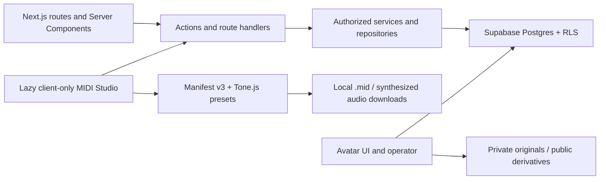

# System architecture

Status: Current after PIVOT-10 and final `master` reconciliation
Deployment state: retained Supabase project rebaselined and reconciled; Vercel not configured

## Runtime boundaries

OpenMIDI is a Next.js App Router application backed by Supabase Auth and Postgres. Supabase Storage is used only for private avatar originals and sanitized public avatar derivatives. PIVOT-10 destructively rebaselined and verified the existing hosted project without changing its project reference or API keys. Vercel is the intended host, but no Vercel project or deployment exists yet. Existing `jam-session-*` manifest engine identifiers remain stable compatibility values during the staged product rename.

The Studio is a lazy client boundary. Tone.js, Web MIDI, browser playback, MIDI import/export, and synthesized local audio export stay inside `src/features/studio/midi-adapter` and the focused instrument runtime. Server Components, actions, route handlers, repositories, and database code operate on validated structured MIDI and never import Tone.js or browser media APIs.

Local synthesized audio is ephemeral and downloadable; it is never uploaded, shared, versioned, or authoritative.

## Main workflows

### Identity and profiles

Supabase Auth owns email and provider identity. A Before User Created hook checks private invitations. The Auth insert trigger creates an incomplete private profile. Username claiming and profile completion are authorized database commands. Public reads use the security-invoker `public_profiles` projection; lifecycle and activity fields remain private.

### Studio and publication

The client edits a canonical manifest-v3 workspace. `save_midi_workspace_v3` validates the complete manifest, replaces normalized workspace tracks/clips, advances optimistic `lock_version`, and records one of at most 20 Postgres recovery snapshots. Publication freezes an immutable arrangement version and normalized projections, then appends a project-revision wrapper in the same transaction.

### Contributions and forks

A contribution workspace begins from an exact base project revision. Submission freezes one immutable arrangement version. Acceptance is stale-base aware and appends a project revision pointing to that exact accepted arrangement; it does not merge automatically. Forking copies project metadata and arrangement projections while retaining exact source project/revision and pattern-version lineage.

### Public reads and discovery

Public project pages, preview, history, attribution, and discovery read arrangement versions and exact MIDI pattern versions. Pattern creator snapshots and CC BY 4.0 lineage survive profile renames and deletion. Public pattern-library listing is explicit and separate from project publication; LIB-01 distinguishes commercially reusable CC BY 4.0 listings from reference-only/no-reuse listings through a bounded safe projection while direct pattern reads remain project/member/owner scoped.

### Moderation, deletion, and avatars

Reports do not hide content. Admin actions change moderation state through security-definer commands with pinned `search_path`. Recoverable deletion preserves immutable references and honors content holds. Avatar originals use a private bucket; sanitized derivatives use a public bucket. The bounded retention operator can delete only proven avatar candidates.

## Current and planned post-pivot workflow boundaries

- **Diff:** repositories load two exact immutable versions only after proving both belong to the same project or pattern history and are independently visible to the caller. Pure feature-owned mapping creates a static landing-matched note overlay; lazy browser-local audition remains separate from comparison selection.
- **Library publication (implemented in LIB-01):** an authorized command validates exact ownership, selected reuse mode, rights-basis/attestation, source-term compatibility, controlled facets, and bounded external credits before exposing a pattern version. Append-only editions retain history; unlisting closes only the active edition. External credits never replace verified platform lineage. `/library` filters All, commercially reusable CC BY 4.0, or reference-only/no-reuse through a maximum-25 keyset query and safe note projection. Card preview is mutually exclusive and browser-local. Future save, import, fork, open-in-editor, and export commands must accept commercially reusable listings only, use exact copy-on-write references, and add no Storage media.
- **Library moderation:** an unoriginal/unauthorized-work report stores private claimant/source context. Only an administrator action changes listing visibility; hiding discovery never mutates immutable notes, lineage, credits, or project history.
- **Library detail and history (implemented in LIB-02):** `/library/[listingId]` resolves one active non-hidden listing through a bounded safe projection. Authorized history contains the listed exact version plus same-pattern versions proven visible through active public projects; comparison rechecks both selected IDs and same-pattern membership before returning notes. Public usage joins only the safe public-project catalog. Private report evidence and idempotent moderation audit rows stay in `private`; optimistic administrator hide/restore changes only listing moderation visibility/version and immediately removes or restores search/detail reads.
- **Challenges:** one safe public projection exposes the administrator-selected featured challenge to the landing page and dashboard. Submission validation remains authoritative on the server/database. Completed challenge/result/leaderboard projections remain addressable and read-only; badge links resolve to those canonical results.

## Authority and security

- Postgres relationships and commands are authoritative; JSON manifests are validated portable snapshots.
- Normal application access is user-scoped and RLS-protected. Service role is limited to local fixtures and bounded avatar/retention operators.
- Published revisions, arrangement versions, pattern versions, contribution versions, attributions, and lineage are immutable.
- Public layouts remain Auth-independent; verified claims/user calls provide identity where required.
- Security-definer functions pin an empty `search_path`, authorize `auth.uid()`, and receive minimum grants.
- No current route, dependency, migration, worker, cron, or environment contract supports uploaded musical media.

## Local validation architecture

`npm run supabase:start` starts database-only validation. `npm run supabase:start:auth` supports the default local browser suite without Storage or Edge Runtime. `npm run supabase:start:storage` is reserved for avatar-specific flows. `npm run check:midi-only` statically prevents legacy musical-media infrastructure from returning.
