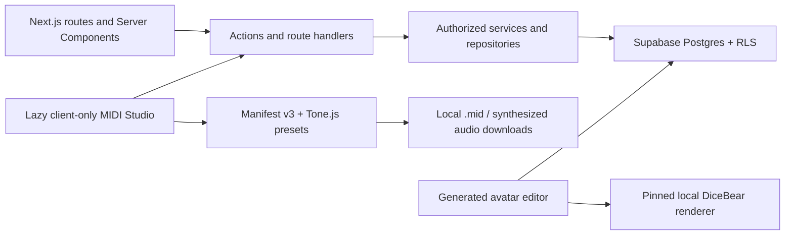

# System architecture

Status: Current after PIVOT-10 and final `master` reconciliation
Deployment state: retained Supabase project rebaselined and reconciled; Vercel not configured

## Runtime boundaries

OpenMIDI is a Next.js App Router application backed by Supabase Auth and Postgres. Optional profile avatars persist a validated configuration and render locally from pinned DiceBear packages; no avatar bytes or URLs are stored. PIVOT-10 destructively rebaselined and verified the existing hosted project without changing its project reference or API keys. The invite-only beta is deployed on Vercel. The `openmidi-*` manifest engine identifiers are the canonical post-RELEASE-01 persisted identifiers.

The Studio is a lazy client boundary. Tone.js, Web MIDI, browser playback, MIDI import/export, and synthesized local audio export stay inside `src/features/studio/midi-adapter` and the focused instrument runtime. Server Components, actions, route handlers, repositories, and database code operate on validated structured MIDI and never import Tone.js or browser media APIs.

Local synthesized audio is ephemeral and downloadable; it is never uploaded, shared, versioned, or authoritative.

## Main workflows

### Identity and profiles

Supabase Auth owns email and provider identity. A Before User Created hook checks private invitations. The Auth insert trigger creates an incomplete private profile. Username claiming and profile completion are authorized database commands. Public reads use the security-invoker `public_profiles` projection; lifecycle, avatar revision, and activity fields remain private. Save/reset commands own the optional validated DiceBear Adventurer Neutral configuration; ordinary display renders it locally as a data URI, and `NULL` selects initials.

The root route is the signed-out marketing entry. A verified active viewer who requests `/` is redirected to `/dashboard`; an incomplete active viewer is sent through `/onboarding`, and suspended or deleted viewers remain outside the application shell. OAuth callbacks always resume through that onboarding gate, so arbitrary protected-route `next` values cannot replace the dashboard as the normal post-sign-in destination. Completing onboarding redirects to `/dashboard`, while later profile edits continue returning to profile settings.

### Studio and publication

The client edits a canonical manifest-v3 workspace. `save_midi_workspace_v3` validates the complete manifest, replaces normalized workspace tracks/clips, advances optimistic `lock_version`, and records one of at most 20 Postgres recovery snapshots. Publication freezes an immutable arrangement version and normalized projections, then appends a project-revision wrapper in the same transaction.

### Contributions and forks

A contribution workspace begins from an exact base project revision. Submission freezes one immutable arrangement version. Acceptance is stale-base aware and appends a project revision pointing to that exact accepted arrangement; it does not merge automatically. Forking copies project metadata and arrangement projections while retaining exact source project/revision and pattern-version lineage.

An owner workspace remains a private mutable draft after acceptance. When its base predates the project's current revision, Studio disables publication and requires an explicit resolution after pending edits receive server acknowledgement. **Continue from latest** atomically archives the stale workspace and creates a fresh active owner workspace from the exact current revision. **Preserve as private fork** creates a private direct fork rooted at the exact stale base, keeps fork revision 1 equal to that base, carries the acknowledged stale draft into the fork's active workspace, and archives the source workspace. Both paths are idempotent database commands; neither silently rebases, automatically merges MIDI, changes the accepted revision, or publishes the recovered draft.

### Public reads and discovery

Public project pages, preview, history, attribution, and discovery read arrangement versions and exact MIDI pattern versions. Project-detail arrangement maps may read deduplicated, permanently cacheable pattern silhouettes through a bounded RPC that rechecks the safe public-project catalog plus current project and owner visibility; raw note rows are not part of that decoration path. Pattern creator snapshots and CC BY 4.0 lineage survive profile renames and deletion. Public pattern-library listing is explicit and separate from project publication; LIB-01 distinguishes commercially reusable CC BY 4.0 listings from reference-only/no-reuse listings through a bounded safe projection while direct pattern reads remain project/member/owner scoped.

### Moderation, deletion, and avatars

Reports do not hide content. Admin actions change moderation state through security-definer commands with pinned `search_path`. Recoverable deletion preserves immutable references and honors profile, project, and contribution holds. Account deletion clears generated-avatar configuration. The bounded retention operator owns deletion-expiry and moderation-metadata candidates only.

## Current and planned post-pivot workflow boundaries

- **Diff:** repositories load two exact immutable versions only after proving both belong to the same project or pattern history and are independently visible to the caller. Pure feature-owned mapping creates a static landing-matched note overlay; lazy browser-local audition remains separate from comparison selection.
- **Library publication (implemented in LIB-01):** an authorized command validates exact ownership, selected reuse mode, rights-basis/attestation, source-term compatibility, controlled facets, and bounded external credits before exposing a pattern version. Append-only editions retain history; unlisting closes only the active edition. External credits never replace verified platform lineage. `/library` filters All, commercially reusable CC BY 4.0, or reference-only/no-reuse through a maximum-25 keyset query and safe note projection. Card preview is mutually exclusive and browser-local.
- **Library moderation:** an unoriginal/unauthorized-work report stores private claimant/source context. Only an administrator action changes listing visibility; hiding discovery never mutates immutable notes, lineage, credits, or project history.
- **Library detail and history (implemented in LIB-02):** `/library/[listingId]` resolves one active non-hidden listing through a bounded safe projection. Authorized history contains the listed exact version plus same-pattern versions proven visible through active public projects; comparison rechecks both selected IDs and same-pattern membership before returning notes. Public usage joins only the safe public-project catalog. Private report evidence and idempotent moderation audit rows stay in `private`; optimistic administrator hide/restore changes only listing moderation visibility/version and immediately removes or restores search/detail reads.
- **Library saved clips and reuse (implemented in LIB-03):** `/library/saved` reads private exact-version bookmarks without copying notes. Every save/import/fork/editor/export command rechecks an exact commercially reusable listing, immutable CC BY terms, moderation, source lifecycle, and actor authority. Import appends a normal clip to an owned private workspace under its existing optimistic lock and never publishes. Fork/editor commands create owned private child patterns before editing, while retained private provenance records preserve source listing/version, creator snapshots, license, and external credits. Creator unlisting preserves earlier valid saved/reference authority; moderation hiding or source deletion blocks new reuse. Preview and attributed Standard MIDI File export remain browser-local.
- **Studio clip collection and import (implemented through CLIP-IMPORT-02):** one bounded Auth-dependent projection deduplicates exact versions across actor-owned **My clips** and explicit **Saved clips**, returns no note arrays, and keeps saved availability/provenance visible when owner authority wins. Exact-version detail loads structured MIDI only after current owner or saved-library authority is rechecked. One serialized transaction imports into any currently editable actor-owned manifest-v3 workspace, including an eligible contribution draft, using the exact optimistic lock and caller start tick. It enforces track/note/duration bounds, replaces the canonical projection, writes the bounded recovery snapshot, and returns the canonical manifest/hash plus immediate playback payload. The responsive **Add from clips** Studio drawer is the sole visible consumer: it lazy-loads collection metadata, previews exact detail through the browser-only MIDI runtime, and applies canonical authority without a route reload or duplicate save.
- **Challenges (implemented through CHALLENGE-03):** administrator commands create a stable identity plus append-only challenge versions containing presentation, frozen UTC phase boundaries, judging-credit snapshots, an optional exact reusable public starter revision, and validated canonical constraint-v1 JSON plus hash. Public `scheduled`, `open`, and `voting` phases derive from those boundaries without cron. Active owners preflight and submit exact immutable revisions; Postgres independently evaluates every constraint. Before voting opens, public functions return no entry identities or counts. During voting, safe entry reads use deterministic SHA-256 ordering from challenge/version, entry ID, and an hourly UTC bucket with stable application cursor links; vote totals never influence order and remain absent until close. Authenticated desired-state vote commands serialize idempotency and the 60/hour attempt budget across every entry for one actor, retain rejected attempts, maintain one private logical vote per voter/entry, reject self/ineligible/late targets, and expose only the caller's active entry IDs. Bounded challenge/entry reports remain private and never hide content; administrators receive the private target, reason, bounded details, and timestamp needed for review. Optimistic commands hide/restore challenges and entries, disqualify entries, or exclude/restore votes with append-only audit. Finalization recomputes eligible active vote totals and every highest-total tie in one transaction, appends immutable complete result/entry-total/placement/favorite rows, and advances `current_result_id`; corrections append a superseding full result version. Completed canonical pages retain frozen challenge/version details and the current permanent result, while public result identities continue to inherit live source-project, entrant-profile, entry, and challenge visibility. Landing and dashboard call the same Auth-independent featured projection, which serializes explicit selection changes, prefers one safe explicit selection, and otherwise falls back to next scheduled, active open/voting, then most recently completed.
- **Challenge awards (implemented in BADGE-01):** three stable badge definitions point to append-only bounded presentation/rule versions. The preserved CHALLENGE-03 finalizer advances `current_result_id` and then derives Winner from place 1, Top Placement from later official places, and every Community Favorite tie from normalized immutable result rows before the transaction returns. Corrections append a complete new award set without updating or deleting superseded evidence. An administrator-only reconciliation command is exact-current-result, serialized, and idempotent; there is no user claim path. Public profiles call a separate maximum-24 keyset projection that exposes only current-result awards whose challenge, entry, source project, and recipient remain visible, with canonical completed challenge/result/entry links and no private vote, moderation, correction, audit, or project-authority data.

## Authority and security

- Postgres relationships and commands are authoritative; JSON manifests are validated portable snapshots.
- Normal application access is user-scoped and RLS-protected. Service role is limited to local fixtures and the bounded metadata retention operator.
- Published revisions, arrangement versions, pattern versions, contribution versions, attributions, and lineage are immutable.
- Public layouts remain Auth-independent; verified claims/user calls provide identity where required.
- Security-definer functions pin an empty `search_path`, authorize `auth.uid()`, and receive minimum grants.
- No current route, dependency, migration, worker, cron, or environment contract supports uploaded musical media.

## Local validation architecture

`npm run supabase:start` starts database-only validation. `npm run supabase:start:auth` supports browser suites without Storage or Edge Runtime. `npm run check:midi-only` statically prevents legacy musical media, avatar uploads, remote DiceBear rendering, and avatar image-processing infrastructure from returning.
