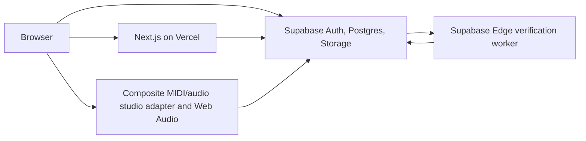

# System Architecture

Status: Accepted MVP design; repository implemented through UX-05; hosted database capability recorded enabled; application deployment and any lock transition remain PR 20 work after PR 19

Audience: engineers and coding agents

## Context

Jam Session combines a conventional web product (identity, profiles, discovery, review workflows) with a browser audio application. These workloads need different rendering and state-management strategies but should share one product shell and authorization model.

## Container view



### Browser

- Receives Server Component HTML for public and authenticated product pages.
- Uses Client Components only for interactive islands.
- Loads the studio via `dynamic(..., { ssr: false })` only after the user selects a project; the `/studio` start state server-renders runtime-free DAW chrome and a blank arrangement without creating a project graph, and an owner without a workspace gets an idempotently created draft and the editor in the selected-project navigation.
- Runs the client-only studio boundary: Waveform Playlist for legacy audio, the planned Tone.js MIDI scheduler/synth, Web Audio, waveform/piano-roll work, quick revision previews and local draft caching. Explore/project quick previews share a browser event so starting one pauses any other mounted MIDI or audio preview.
- Uploads large files directly to Supabase Storage using a short-lived authenticated session or signed upload flow. Audio bytes must not transit a Vercel Function.

### Next.js application

- App Router, TypeScript strict mode and Node runtime by default.
- Server Components perform reads where streaming/SEO helps.
- Server Actions handle small same-origin mutations; Route Handlers handle resumable upload coordination, callbacks and stable API endpoints.
- The application service layer owns multi-table workflows such as publish, submit, accept and fork.
- Middleware/proxy only refreshes auth cookies and performs optimistic redirects. It is not an authorization boundary.

### Product shell and navigation

- The root layout owns one skip link, persistent header, and footer so public, Auth, profile, project, upload, revision, and studio routes share navigable product chrome.
- The header exposes implemented top-level destinations: dashboard, Explore, projects, contributions, uploads, new project, and account. Desktop uses active pill navigation; narrow layouts use a semantic disclosure rather than horizontal overflow. STUDIO-01 adds Studio as a first-class destination while project-specific history/settings links remain contextual.
- Public HTML renders a complete signed-out shell without a server-side Auth dependency. A small Client Component listens for Supabase Auth changes and route transitions, calls `getClaims()` to verify identity, and progressively replaces sign-in links with account or create-project destinations.
- This Auth-aware display is convenience only. Server Components, server actions, Route Handlers, database commands, and RLS independently authorize every protected destination.
- Navigation and landing-page actions must remain keyboard accessible at the 320 px minimum layout. User-facing surfaces follow the warm studio-night system in [`docs/design/brand.md`](../design/brand.md): primary coral-to-gold actions use the dark accent foreground with WCAG 2.2 AA contrast, and shared buttons use the landing page's pill shape. Do not place white or light text on coral or gold fills.

### Supabase

- Auth: Google OIDC identities; `auth.users` is private identity authority. Additional providers are post-MVP.
- Postgres: domain state, relationships, search metadata and authorization policies.
- Storage: immutable legacy source audio, revision workspace snapshots, artwork/avatars and derived previews/peaks. MIDI notes and synth parameters remain bounded relational/manifest data rather than Storage objects.
- RLS: final enforcement for browser-accessible data.

## Rendering and route map

| Route                                     | State       | Rendering                         | Notes                                                      |
| ----------------------------------------- | ----------- | --------------------------------- | ---------------------------------------------------------- |
| `/`                                       | Implemented | Server-rendered                   | Public product shell                                       |
| `/explore`                                | Implemented | Server-rendered + client previews | Bounded canonical GET filters and keyset pagination        |
| `/@{username}`                            | Implemented | Server-rendered                   | Canonical profile display uses `@`; database stores no `@` |
| `/dashboard`                              | Implemented | Authenticated Server Component    | Bounded private work summaries and review count            |
| `/projects`                               | Implemented | Authenticated Server Component    | RLS-scoped member project index and next-action links      |
| `/projects/{projectId}`                   | Implemented | Public/member + client preview    | Safe anonymous metadata branch or full member presentation |
| `/projects/{projectId}/studio`            | Implemented | Server redirect                   | Compatibility redirect to canonical selected route         |
| `/studio`                                 | Implemented | Authenticated persistent shell    | Runtime-free project-independent blank workstation         |
| `/studio/{projectId}`                     | Implemented | Server resolver + lazy client     | Canonical independently authorized selected session        |
| `/contributions`                          | Implemented | Authenticated Server Component    | Author-owned contribution status and version index         |
| `/projects/{projectId}/contributions`     | Implemented | Authenticated server page         | Owner review queue or contributor-owned submissions        |
| `/projects/{projectId}/contributions/new` | Implemented | Authenticated server page         | Eligible non-owner contribution creation                   |
| `/auth/callback`                          | Implemented | Route Handler                     | Exchanges OAuth code and redirects to onboarding if needed |

Use stable opaque IDs in project URLs for MVP. Human-readable slugs can be added later without changing identity.

## Authentication and onboarding

1. Supabase completes OAuth and establishes a cookie-backed SSR session.
2. A database trigger creates an incomplete `profiles` row keyed by `auth.users.id`. Username, display name, credit name and completion time remain null; provider metadata is never trusted as public identity.
3. A new user is redirected to onboarding. Username may be claimed first through the atomic `claim_username()` command, but the row remains incomplete until display name, credit name and the completion timestamp are set together by the onboarding command introduced with the authentication UI.
4. Username claim is a single database function/transaction backed by a unique normalized index and reserved-name policy.
5. Server code obtains the user with a verified Supabase auth call and relies on RLS plus explicit service authorization.

Only completed, active rows from the safe public-profile projection become `PublicUser` values. Database onboarding fields are nullable; the public domain shape is deliberately non-nullable. Email does not belong in the public profile table or public `User` DTO. PR 17 implements avatars as private immutable originals processed by a trusted lease-bound Edge worker into versioned, sanitized 512×512 WebP derivatives in the public `public-avatars` bucket. Public DTOs expose only the derivative path/version and use deterministic initials as fallback. The domain shapes are:

```ts
type PublicUser = {
  id: string;
  username: string;
  displayName: string;
  creditName: string;
  avatarUrl: string | null;
  bio: string | null;
};

type Viewer = PublicUser & {
  email: string | null;
  status: "active" | "suspended" | "deleted";
  lastActiveAt: string | null;
};
```

Dates crossing a network or Server/Client Component boundary are ISO 8601 strings, not JavaScript `Date` instances. Render handles as `@${username}`. Accept either `name` or `@name` in search input, stripping the leading `@` before normalization.

## Core workflows

### Create and publish

1. Create a private project and owner membership.
2. Create a workspace draft based on no revision or the current revision.
3. Client validates and uploads source audio to an immutable asset path.
4. Client saves the versioned Jam Session workspace manifest exported through the studio adapter.
5. `publish_project_revision()` locks the project and usage projection, canonicalizes and checksums manifest v1, verifies trusted-ready owned assets, confirmed source credits, and active instruments, creates immutable revision, track and reference rows, enforces unique retained project bytes, advances `projects.current_revision_id`, and writes a bounded activity event atomically. Revision-track and publisher snapshots are created in the same transaction. First publish changes a private project from draft to active without opening contributions.

PR 10 implements steps 2–4 for project owners. Workspace creation copies the exact current immutable revision into a private draft. Every save submits the expected `lock_version`; the database locks the workspace, rejects stale writers, validates the complete manifest and referenced trusted-ready assets, replaces the normalized workspace-track projection, records an immutable private recovery snapshot, and increments the version atomically. Autosave never advances `projects.current_revision_id` or changes a published revision.

PR 11 completes owner publication with `publish_workspace_revision()`. The wrapper locks the project and workspace in a fixed order, reads only the authoritative saved manifest, calls `publish_project_revision()` in the same transaction, then advances the active workspace base and lock. A stale base cannot publish; the explicit restart command archives the stale draft and clones the current revision without merging. Stem export returns short-lived download-disposition URLs so bytes travel from private Supabase Storage to the browser rather than through Next.js. WAV mix export stays inside the lazy client adapter and is bounded to ten minutes and an estimated 128 MiB output.

### Submit a contribution

1. Contributor creates a workspace based on revision `R`.
2. Saving is private and may overwrite the draft snapshot.
3. Submission freezes the draft into proposed revision `C`, records `base_revision_id = R`, and changes contribution state from `draft` to `submitted`.
4. Subsequent changes require a new contribution revision; submitted bytes are not overwritten.

PR 12 implements steps 1–4 for non-owner members who already have access to an active private project. Creation atomically links a contribution to an author-owned workspace cloned from the exact current revision. Autosave remains private and conflict-safe. Submission locks project, contribution, and workspace in that order, requires the exact acknowledged lock/checksum/snapshot and contributor-attestation-v1, then copies the manifest and normalized tracks into immutable version rows without advancing project history or project storage usage. Withdrawal archives the workspace while retaining versions. PR 13 builds owner review and acceptance on those immutable records.

### Accept a contribution

1. Lock the contribution and target project.
2. Verify reviewer ownership, status `submitted`, and base revision.
3. If the project has advanced, mark the contribution `changes_requested` with reason `base_outdated`; do not attempt an automatic audio merge in MVP.
4. Otherwise copy the proposed snapshot references into a new project revision, record `accepted_contribution_id`, advance the current revision, and mark the contribution accepted in one transaction.
5. Copy confirmed ordered source-credit snapshots to the new revision and record the contribution author, not the reviewer, as the accepted-contributor attribution.

PR 13 implements this review boundary for the single project owner. Review attempts are immutable and idempotent. Request changes re-enables the existing exact-base workspace, rejection archives it, and acceptance revalidates the exact submitted manifest/projection before creating a contribution-linked revision, advancing the pointer, updating unique project asset usage, recording bounded activity, and archiving the workspace in one transaction. A stale accept instead records `base_outdated` and moves the contribution to `changes_requested`; no automatic merge or rebase occurs. Exact submitted-version audio remains private and is signed only for its author or owning reviewer through user-scoped RLS.

PR 14 adds the credit boundary used by every publication path. Trusted verification creates a provisional uploader-derived credit suggestion, but an active source owner must explicitly confirm an ordered 1–12-credit set containing at least one creator before the asset can enter a workspace, submission, or revision. Transaction triggers copy those confirmed rows into immutable per-track snapshots and create a separate publisher attribution; accepted revisions also snapshot the contribution author. Public profile links are resolved only through the safe profile projection, while retained snapshot names survive rename, suspension, or deletion.

### Fork

Forking is metadata-copy-on-write, not file duplication. The `fork_project(...)` transaction creates a private project owned solely by the caller, copies the exact selected immutable revision into revision 1, reuses its immutable asset references and credit/attribution snapshots, inherits the source license and taxonomy, and emits one bounded activity event. It rejects inaccessible, inactive, stale-license, non-derivative, or mismatched source revisions. `source_project_id` and `source_revision_id` are immutable lineage, direct child lists are bounded and RLS-filtered, and unavailable parents render a safe fallback. The editable workspace is created lazily on first studio use. Losing access to or soft-deleting the source does not break the surviving fork because authorization and retention follow the fork's own project/revision references rather than the source owner's membership or Storage path.

## Browser studio integration boundary

### Decision

Create a Jam Session `StudioAdapter` interface and one `WaveformPlaylistStudioAdapter` implementation. Pin exact Waveform Playlist packages and any direct Tone.js dependency. Never persist live editor objects or decoded `AudioBuffer` instances.

```ts
interface StudioAdapter {
  prepare(manifest: WorkspaceManifestV1, actorId: string): void;
  load(input: StudioLoadInput): Promise<void>;
  retryTrack(input: RetryStudioTrackInput): Promise<void>;
  play(): Promise<void>;
  pause(): void;
  seek(seconds: number): void;
  addAudioAsset(input: AddAudioAssetInput): Promise<TrackRef>;
  removeTrack(id: string): void;
  updateTrack(id: string, patch: TrackPatch): void;
  reorderTracks(trackIds: readonly string[]): void;
  exportManifest(): WorkspaceManifestV1;
  renderMix(): Promise<Blob>;
  dispose(): Promise<void>;
}
```

Persist a versioned **Jam Session manifest** containing asset IDs, stable track IDs, positions, trims, labels, gain, pan, mute/solo, order and basic tempo metadata. It is the authoritative collaboration subset, supports server validation and migrations, and prevents the editor library from becoming the data model. Each saved workspace records `engine = 'waveform-playlist'`, an exact adapter/package compatibility version, `manifest_version`, and a checksum. A future engine-native artifact may be added as an optional fidelity aid but is not required for MVP reopen.

OPT-02 makes hydration manifest-first. `prepare()` creates placeholder clips and exposes arrangement/mixer controls before private source signing or transfer completes; `load()` then attaches decoded buffers to the matching stable track IDs without replacing the manifest. Each track reports `queued`, `loading`, `decoding`, `ready`, or `failed`, and synchronized play is unavailable until every currently audible track is ready. Failed tracks retry independently, navigation/removal ignores late work, and save/publish continue to serialize only the validated manifest while audio is pending.

Decoded buffers may be reused only through the bounded in-memory registry inside the client adapter. It is keyed by verified viewer ID plus immutable asset ID, clears on actor change/sign-out, evicts failed work and least-recently-used decoded buffers, and is capped at 12 entries/384 MiB. Signed URLs are never cache identities, and decoded bytes are never persisted across browser sessions. Source fetches use normal browser caching for the same signed URL; authorization responses and signed-source descriptors remain `private, no-store`.

### Completed integration spike and productionization gate

PR 05 proved the following in a disposable vertical slice before persistence depended on the editor. PR 09 removed the spike route and productionized its read-only playback subset. PR 10 promoted the supported editing subset—add/remove/reorder, position, trim, label, instrument, gain, pan, mute and solo—into the validated manifest and conflict-safe workspace boundary. PR 11 wired the proven WAV export hook into the production adapter and added authorized direct source downloads. Historical results are in [`evidence/pr-05-waveform-playlist-spike.md`](evidence/pr-05-waveform-playlist-spike.md); current evidence is in [`evidence/pr-09-production-studio.md`](evidence/pr-09-production-studio.md), [`evidence/pr-10-editable-workspaces.md`](evidence/pr-10-editable-workspaces.md), and [`evidence/pr-11-export-download-publishing.md`](evidence/pr-11-export-download-publishing.md).

- Open a project in the Next.js client boundary without SSR/build failures.
- Import two signed Storage audio URLs, play them sample-synchronously and seek.
- Change gain/pan/mute/solo and position one region.
- Serialize, reload after a hard refresh and produce the same arrangement.
- Add a new stem while preserving its stable Jam Session asset ID through adapter hydration and export.
- Export a WAV mix and, where supported, individual tracks.
- Confirm AudioWorklet, worker, CSP and audio-source requirements on a Vercel preview deployment; do not enable cross-origin isolation or WASM allowances without measured need.
- Measure the studio lazy chunk, decoded-audio memory and time-to-interactive on a mid-range device.
- Document package APIs actually used and lock versions.

The selected React package surface passed the automated gate. If later editable-workspace work exposes a blocker, evaluate Waveform Playlist's framework-independent engine/Web Components or a Jam Session UI over Tone.js before changing the persistence model. OpenDAW is a post-MVP alternative requiring a separate ADR and licensing review.

### Dependency and licensing controls

Waveform Playlist and Tone.js are MIT-licensed. Preserve their notices, retain the exact direct version pins and validated lockfile, and rerun manifest/adapter fixtures for deliberate upgrades. Do not copy demo audio, styles, or other repository assets unless their redistribution terms are known. Any later OpenDAW integration must resolve its AGPL/commercial licensing path before network deployment.

OPT-01 selected `mediabunny@1.50.8` and `@mediabunny/flac-encoder@1.50.8` as the focused browser FLAC candidate for OPT-03. Both are MPL-2.0 and the extension embeds libFLAC WASM; adoption requires exact pins, preserved MPL/libFLAC notices, and a lazy dedicated upload worker. The feasibility choice does not authorize a server import, a main-thread encoder, or conversion without the documented original-WAV fallback. Measurements and remaining Safari/memory checks are recorded in [`evidence/opt-01-audio-delivery-baseline.md`](evidence/opt-01-audio-delivery-baseline.md).

OPT-03 adopts those exact pins behind a dynamically imported, upload-owned module and a dedicated module worker. A capable browser may convert a newly selected WAV to FLAC before reservation; the worker observes the same decoded PCM sent to the encoder to generate a transient versioned peak summary. The wrapper rejects an invalid signature, metadata mismatch, out-of-range duration/sample rate/channel count, oversized output, or malformed peaks before Storage coordination. Successful FLAC bytes become the only canonical immutable source object and source download for that new asset; the selected WAV bytes are not uploaded or retained. Cancellation, unsupported Worker/WASM capability, reported low device memory, conversion failure, and allocation failure all return control to an explicit original-WAV upload path before any asset is reserved. Existing assets are never rewritten, and FLAC/MP3 selections remain byte-for-byte upload candidates. Peak persistence and authorization remain OPT-04 scope.

OPT-04 persists only OPT-03's 2,048-bin per-channel min/max summary as compact `JSPK` v1 presentation data. The binary header binds format/algorithm, exact source asset, channels, duration and sample rate; signed 16-bit bounds keep a 1–8-channel derivative between about 8 and 64 KiB, below the 512 KiB ceiling. The owner reserves a server-generated `{owner}/{source}/{derivative}/peaks.v1.bin` path, uploads directly to private `derived-assets`, and asks a user-scoped server action to download and validate the small object before the database finalizes it. Finalization verifies the immutable object metadata and source relationship but never changes source status, credits, history, or manifests. Ready derivatives count in global actual Storage capacity and not user source quota.

Authorized studio source batches include trusted source metadata and an optional signed peak descriptor only when the derivative still matches the verified source. The adapter downloads peaks concurrently with canonical audio, validates the signed descriptor, digest and binary again, and supplies Waveform Playlist's supported peaks-first `waveformData`. Missing, unauthorized, corrupt or stale peaks remain a placeholder until normal decode attaches the authoritative buffer; decoded audio replaces the coarse presentation summary for full zoom fidelity. Existing sources are not backfilled and ordinary reads never mutate them.

### MIDI-first composite successor

After the $0 audio optimization pass, evolve—but do not bypass—the `StudioAdapter` boundary into a composite implementation. Waveform Playlist remains responsible for existing audio tracks. A MIDI controller inside the same client-only feature boundary uses the pinned Tone.js runtime for transport-clock scheduling and versioned synthesis presets. Piano-roll UI and recording emit Jam Session MIDI commands; Tone.js objects, Web MIDI ports/messages, audio nodes, and device identifiers never cross into server code or persisted state.

UX-01 makes the browser audio context the single selected-Studio transport clock. The runtime records the exact context-time origin and seek offset used for MIDI and compatible audio scheduling; animation frames only project that snapshot into the playhead and Play/Pause state. Mixer-only manifest changes ramp the existing MIDI and audio gain/pan nodes and do not recreate the runtime or stop transport. Structural schedule changes may pause playback, but the same runtime snapshot must first preserve the exact position and make the UI state truthful. This clock, active nodes, and scheduling state remain disposable browser session data and never enter manifests or server payloads.

MIDI-01 freezes route-neutral adapter capabilities and a `StudioSessionDescriptor` that carries authorized data, capabilities, and canonical links without deriving permissions from route shape or owner IDs. MIDI-05 implements that descriptor for the composite runtime. Studio route migration later reuses the same resolver; it does not change project/workspace authorization.

The standalone MIDI editor delivered in MIDI-02–MIDI-04 is a reusable editor foundation, not the final owner of MIDI creation. Studio integrates the same Jam-owned semantic note commands, piano-roll renderer, accessible inspector, recorder, and client-only audition boundary. Project transport remains the clock while recording in context. A private stem draft autosaves independently from the project workspace; it may be auditioned as a session overlay, but it is not publishable project authority. An explicit finalize command creates an immutable stem version and atomically inserts or replaces the selected workspace clip. Project manifests, revisions, contribution versions, and forks continue to reference exact immutable versions only.

UX-05 keeps piano-roll selection and gesture previews inside that shared editor boundary. Marquees are transient tick/pitch rectangles projected to canvas pixels only while rendering; selected note IDs stay synchronized with the accessible note list. A completed move emits one existing `moveNotes` command, while copy-drag and keyboard paste emit one bounded semantic duplication command with fresh note IDs. Cancelled previews, tool choice, clipboard contents, and selection geometry never enter draft autosave or immutable stem payloads.

Manifest v1 remains the immutable compatibility contract for existing audio history. Add manifest v2 as a discriminated union of audio and MIDI tracks with stable clips for both kinds. A v1 audio track maps deterministically to one v2 audio track with one clip referencing the same source asset; the initial audio model keeps one source asset per track so credits and retention remain coherent. MIDI tracks contain bounded tick-based immutable stem-version references and an immutable preset ID/version; they never fabricate source-asset IDs. Existing workspaces upgrade only when an owner intentionally saves v2 content, copying audio references exactly. Published v1 revisions are not rewritten. Splitting remains unavailable until normalized clip projections round-trip through save, publish, submit, accept, and fork.

MIDI-07 prepared the transition controls, STUDIO-01 makes `/studio` the authenticated start state and `/studio/{projectId}` the canonical selected-session route, and STUDIO-02 adds bounded project browsing plus shared creation inside the persistent shell. UX-02 presents that state as a blank workstation and moves project lifecycle commands into File. UX-03 keeps an empty named MIDI lane only in selected-session React state; it becomes authoritative solely when compatible immutable clip data is pasted or `finalize_studio_midi_draft(...)` atomically freezes the private draft and creates its track/clip. Copy/Paste adds stable clips within a MIDI container, Duplicate clones the complete MIDI track with fresh stable IDs, and non-overlapping moves may extend manifest duration so intentional silence remains authoritative. The current nested route redirects compatibly. Every destination route reauthorizes and remounts one session subtree keyed by project/session authority. The selected subtree registers only framework-light lifecycle and presentation ports (`status`, edit/acknowledged generations, recovery availability, requested save, idempotent disposal, and an optional export-surface focus action); the shell never reaches into Waveform, Tone, decoded buffers, signed URLs, or export implementation details. Switch and close intents serialize through the lifecycle port, save the exact acknowledged generation, preserve actor/workspace-scoped recovery on offline/error/conflict exits, abort loading, silence playback/MIDI, and dispose before navigation. Decoded-source reuse remains actor/asset scoped and occurs only after the destination independently authorizes the same immutable asset. No `studios` table is introduced.

The MIDI editor must work with pointer, keyboard and an on-screen piano. Hardware Web MIDI is optional progressive enhancement requested only from an explicit gesture in a secure context, without System Exclusive access. Initial sounds are code-owned synthesis presets without remote samples. A preset change creates a new version so historical playback does not drift.

MIDI-07 implements and tests the trusted source-admission capability, including disabled-mode bypass protection, and ships it enabled while Studio is rebuilt. Only after Studio-native track creation, piano-roll editing, contextual recording, timeline arranging/mixing, save/reload, publication, preview, contribution acceptance, fork and `.mid` export pass the STUDIO-06 parity gate may the prototype disable new source admission. The repository passes that gate, but the hosted database capability remains enabled and application deployment is deferred through PR 19; PR 20 therefore owns hosted parity and any separately authorized transition. The lock is enforced in `reserve_source_asset` before reservation/quota mutation and represented as a global prototype capability—not a subscription or user entitlement. Existing ready audio, valid in-flight reservations during the documented deployment grace period, private signing, downloads, export, publication and forks remain supported. The repository runbook records enablement, rollback, and hosted-authorization requirements.

## Upload and asset processing

- Use resumable uploads for large audio files.
- Accept WAV (`audio/wav`, `audio/x-wav`), FLAC (`audio/flac`) and MP3 (`audio/mpeg`) after signature and decode validation; reject extension/MIME mismatches. Recommend FLAC for lossless uploads and MP3 only when lossy source quality is acceptable.
- Enforce 45 MiB and 10 minutes per audio asset, 12 source stems and 250 MiB of uniquely referenced source audio per project, and 200 MiB of owned source audio per user. Fork references do not consume a second copy of quota.
- The implemented reservation gate counts registered ready/reserved source and peak-derivative bytes, warns at 750 MiB and rejects above 850 MiB. Until PR 18 reconciles actual objects across every bucket, operators also inspect provider Storage/egress usage before cohorts and weekly during invites, pausing admission on the first application warning, provider alert or unexplained drift. Never recover capacity by deleting a referenced canonical source.
- Treat client MIME type, filename and duration as untrusted hints.
- Store the final canonical candidate bytes immutably and calculate SHA-256, byte size and verified media metadata asynchronously. For a newly optimized WAV, those canonical bytes are FLAC and the selected WAV container is not retained; unoptimized WAV, FLAC and MP3 inputs remain unchanged.
- Quarantine an upload until validation succeeds. It cannot be published or shared before `asset.status = 'ready'`.
- PR 11.5 atomically enqueues a private verification job when upload completion commits, immediately invokes a `us-west-2` Supabase Edge Function with the user JWT, and uses a service-role-only two-minute lease for the single Storage download and terminal quota transition. Transient faults retry once; an indexed minute recovery check makes no Edge request while idle and recovers missed kicks or expired leases.
- Verification status uses short bounded polling, not Realtime. Owners see queued/verifying/retrying/delayed/ready/failed states and may restart a dead job without uploading bytes again after a cooldown.
- Generate waveform peaks asynchronously. OPT-04 peak generation stays in the upload worker and finalizes only a small browser-produced derivative; no request path decodes or transcodes audio. A stored browser-produced audio mix preview remains a separate future legacy-audio delivery decision because it needs revision linkage, derivative lifecycle, authorization/retention and atomic publication semantics. It is not MIDI-05's schedule/preset preview. Do not make Vercel request duration the processing contract.
- A job table/outbox can trigger an external worker later; the MVP may compute peaks client-side if results are validated and the original remains authoritative.
- The user-facing upload history selects only `assets.kind = 'source_audio'`. Workspace snapshot manifests and future derived assets are internal implementation records, not user uploads, even though RLS may permit their owner to select the rows for authorized workflows.
- During the MIDI transition, do not remove upload/verification schema or Storage policies needed by existing history. After the capability lock, new reservation fails before creating an asset or changing quota; already ready sources remain visible in upload history and authorized legacy workflows.

## Security and privacy

- Private buckets by default. Public audio uses short-lived signed URLs after a database authorization check; avoid permanent public source-stem URLs.
- Avatars and published cover images may use a public bucket.
- Validate authorization both in service logic and RLS. RLS is mandatory defense in depth.
- Rate-limit username claims, uploads, project creation, contribution submission and search.
- Sanitize user-authored text at render boundaries; descriptions remain plain text or a restricted Markdown subset.
- Set a strict CSP and narrow worker/audio/media sources to required origins.
- Never log OAuth tokens, signed URLs, manifests containing private object references, or decoded audio.
- Soft deletion hides content immediately. A retention job later removes unreferenced assets after the recovery window.

## MVP beta admission

The existing Before User Created Postgres hook remains the sole account-creation admission authority and exact-matches `lower(btrim(email))` against active rows in the private signup invitation table. An active, completed administrator can activate one current-state invitation from the authenticated dashboard through a narrowly granted security-definer command. The command independently calls the exception-raising private administrator guard, serializes by normalized email, and is idempotent for active rows; reactivation records the current administrator and timestamp.

This operation adds allowlist access only. It does not call the Supabase Auth Admin invitation API, send email, pre-create an Auth user, or expose invitation addresses through the Data API. The administrator tells the collaborator separately to visit Jam Session and choose the matching Google account. The dashboard visibility probe is display-only and returns `false` for ineligible viewers; all administrator mutations continue to use the exception-raising command guard.

## MVP moderation and retention

The implemented invite-only demo provides in-product report actions on projects, profiles and contributions. Reports require a fixed reason (`copyright`, `harassment`, `sexual_content`, `hate_or_violence`, `spam`, or `other`) plus optional bounded detail and enter a private administrator queue. Administrator authority is checked in the database for every queue/action/hold command. Administrators can hide content, reject an eligible unreferenced upload, suspend an account, restore an item, or place/release a legal or abuse hold; every applied action is append-only and records actor, reason and timestamp. There is no automated content classification in the MVP.

Reported content remains hidden only when an administrator takes action; reporting alone does not automatically remove it. Material presenting an immediate safety or clear legal risk may be hidden pending review. The product must publish concise community rules prohibiting illegal content, non-consensual/private material, targeted harassment, hateful or violent threats, spam/malware and uploads the user lacks permission to share. A production launch additionally requires an appeal path and formal copyright/takedown contact.

Retention schedule:

| Data                                  | MVP retention                                                               |
| ------------------------------------- | --------------------------------------------------------------------------- |
| Rejected/withdrawn contribution       | Visible to author and project owner for the life of the project; not public |
| Failed/incomplete upload              | Delete after 24 hours                                                       |
| Abandoned workspace draft             | Delete after 30 days without activity, after a 7-day warning when practical |
| Soft-deleted project/account content  | Recoverable for 30 days, then eligible for reference-aware deletion         |
| Security/audit and moderation records | 180 days; metadata only, with restricted administrator access               |
| Application diagnostic logs           | 7 days where the provider permits; no tokens, signed URLs or audio payloads |
| Published attribution snapshot        | Retained with the surviving revision/fork as required for provenance        |

Users may delete their own rejected contribution earlier if it has not been accepted and is not required for a moderation/legal hold. A legal or abuse hold pauses deletion. Storage deletion is always reference-aware so a surviving revision or fork cannot be broken. Manual operation is authoritative: `retention:preview` is read-only, while `retention:execute` claims bounded jobs with `FOR UPDATE SKIP LOCKED`, deletes bytes only through the Storage API, and finalizes domain/quota state only after deletion or already-missing confirmation. Cron is optional convenience and must reuse this operator.

## Caching and consistency

- Public project/profile pages use safe projections and transactional discovery-version cache keys, with tags for prompt application-driven revalidation.
- Viewer-specific pages and signed URLs are never shared-cacheable.
- Database mutation commits before cache revalidation; stale cache affects presentation, not authorization.
- Use optimistic concurrency on workspaces (`lock_version`) and projects (`current_revision_id`). A stale client receives a conflict rather than overwriting newer state.
- All externally retried commands accept an idempotency key.

## Availability and browser support

Target support is current stable Chrome/Edge, Safari, and Firefox desktop. The implemented studio feature-detects the required Web Audio APIs, secure context, desktop-sized screen, and precise pointer; mobile pages remain responsive while the studio shows a desktop-required message. Automated Chromium evidence exists, while audible and full multi-browser verification remains conditional in the evidence documents. Never infer capability solely from user agent.

The repository is currently pinned to Next.js 16.2.10. A route-level `loading.tsx` at or above the dynamic studio route caused the Next.js development debug channel to misclassify Firefox streaming navigation as a cache restore and hard-refresh indefinitely (`vercel/next.js#94128`). The studio therefore intentionally has no such loading boundary. Restore one only as part of a deliberate Next.js upgrade after the fix is present in the pinned stable release and a focused Firefox studio-navigation regression check passes.
