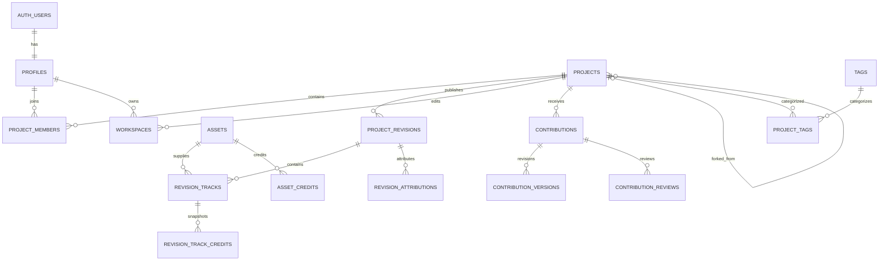

# Data Model and Supabase Design

Status: Accepted MVP design; implemented through PR 17 with additive MIDI model planned before PR 18

Database: Supabase Postgres

## Modeling principles

- Keep mutable collaboration metadata separate from immutable musical history.
- Normalize relationships needed for authorization, discovery and attribution.
- Use JSONB only for versioned Jam Session/engine manifests or bounded flexible event payloads, not primary relationships.
- Store large binary objects in Storage and their identity/authorization metadata in Postgres.
- Prefer restrictive constraints and explicit state transitions over application convention.

## Relationship overview



## Enumerations

Use Postgres enums only for stable lifecycle sets. Additive enum migrations are acceptable; frequently changing taxonomies use tables.

```sql
create type account_status as enum ('active', 'suspended', 'deleted');
create type project_visibility as enum ('private', 'unlisted', 'public');
create type project_status as enum ('draft', 'active', 'archived', 'deleted');
create type member_role as enum ('owner', 'editor', 'viewer');
create type asset_status as enum ('reserved', 'uploading', 'processing', 'ready', 'failed', 'deleted');
create type asset_kind as enum
  ('source_audio', 'workspace_snapshot', 'mix_preview', 'waveform_peaks', 'image');
create type asset_credit_role as enum
  ('creator', 'performer', 'producer', 'engineer', 'other');
create type contribution_status as enum
  ('draft', 'submitted', 'changes_requested', 'accepted', 'rejected', 'withdrawn');
create type revision_attribution_kind as enum
  ('publisher', 'accepted_contributor');
```

Workspace status is constrained text (`active` or `archived`). PR 12 added the complete `contribution_status` enum: `draft`, `submitted`, `changes_requested`, `accepted`, `rejected`, and `withdrawn`. PR 12 commands produce draft, submitted, and withdrawn; PR 13 owner review produces changes requested, accepted, and rejected.

## Identity

### `profiles`

| Column                 | Type               | Rules                                                         |
| ---------------------- | ------------------ | ------------------------------------------------------------- |
| `id`                   | `uuid`             | PK and FK `auth.users(id)` on delete restrict                 |
| `username`             | `text null`        | display casing; 3–30 chars; no leading `@`; null before claim |
| `username_normalized`  | `text null`        | lower-case canonical value; unique; paired with username      |
| `display_name`         | `text null`        | 1–80 chars; null during onboarding                            |
| `credit_name`          | `text null`        | 1–120 chars; snapshots copied to published credits            |
| `bio`                  | `text null`        | max 500 chars                                                 |
| `status`               | `account_status`   | default active                                                |
| `profile_completed_at` | `timestamptz null` | requires username, display name and credit name               |
| `created_at`           | `timestamptz`      | default `now()`                                               |
| `updated_at`           | `timestamptz`      | trigger-maintained                                            |
| `last_active_at`       | `timestamptz null` | throttled update, not every request                           |
| `avatar_version_id`    | `uuid null`        | current trusted derivative version                            |
| `avatar_path`          | `text null`        | safe versioned path in `public-avatars`                       |
| `avatar_updated_at`    | `timestamptz null` | current pointer installation/removal time                     |

Recommended checks:

```sql
check ((username is null) = (username_normalized is null)),
check (username is null or (username = btrim(username) and username ~ '^[A-Za-z0-9_]{3,30}$')),
check (username is null or username_normalized = lower(username)),
check (display_name is null or (display_name = btrim(display_name) and char_length(display_name) between 1 and 80)),
check (credit_name is null or (credit_name = btrim(credit_name) and char_length(credit_name) between 1 and 120)),
check (bio is null or char_length(bio) <= 500)
```

The Auth trigger inserts only the user ID and ignores provider metadata, producing an incomplete row. Only completed active profiles are public. A security-invoker `public_profiles` view exposes safe identity columns; authenticated users may additionally read their own safe projection while incomplete, suspended or deleted. Application roles have no direct profile DML, and lifecycle/activity columns are not selectable through the public view. Profile completion is a separate onboarding command, not a direct update policy.

Reserve names such as `admin`, `api`, `auth`, `explore`, `projects`, `settings`, `support` in a non-readable `reserved_usernames` table. Claim through one self-authorized security-definer function with a fixed empty `search_path`, row lock and unique index on `username_normalized`. Claims are idempotent for the same normalized name; renames and reassignment are deferred.

Administrator membership lives in unexposed `private.app_admins`; the no-argument `private.is_admin()` helper checks only the current authenticated user and grants no automatic RLS bypass. `touch_viewer_activity()` writes only the verified caller and only when the prior value is at least 15 minutes old. Avatar reservations create `assets(kind='image')` private originals plus one `profile_avatar_versions` candidate; trusted finalization atomically swaps the safe profile pointer and queues superseded private/public objects for lease-bound cleanup.

The `profiles.id` foreign key deliberately uses `on delete restrict`: deleting an Auth user must wait for the future account-deletion workflow to anonymize identity safely without erasing attribution.

Do not duplicate email into `profiles`. Email comes from `auth.users` for the authenticated viewer only. This prevents accidental exposure through profile selects and avoids sync bugs.

## Projects and membership

PR 06 implemented the private metadata foundation as `projects`, `project_members`,
`project_genres`, and `project_tags`, with explicit `lock_version` optimistic
concurrency and `(owner_id, create_request_id)` idempotency. The initial controlled
catalog is 4 licenses, 12 genres, 16 tags, and 16 instruments with fixed IDs.
PR 08 added `current_revision_id` with a same-project composite foreign key when
immutable revisions landed. PR 15 added the immutable `source_project_id` and
`source_revision_id` pair plus a same-project source-revision foreign key for
copy-on-write lineage.

### `projects`

| Column                                     | Type                 | Rules                                                 |
| ------------------------------------------ | -------------------- | ----------------------------------------------------- |
| `id`                                       | `uuid`               | PK                                                    |
| `owner_id`                                 | `uuid`               | FK profiles                                           |
| `title`                                    | `text`               | 1–120 chars                                           |
| `description`                              | `text null`          | max 5,000 chars                                       |
| `visibility`                               | `project_visibility` | default private                                       |
| `status`                                   | `project_status`     | default draft                                         |
| `open_to_contributions`                    | `boolean`            | default false                                         |
| `bpm`                                      | `numeric(6,3) null`  | > 0 and <= 400                                        |
| `musical_key`                              | `text null`          | canonical application enum value                      |
| `time_signature_numerator`                 | `smallint`           | default 4, 1–32                                       |
| `time_signature_denominator`               | `smallint`           | default 4, in 1,2,4,8,16,32                           |
| `license_code`                             | `text`               | FK `licenses(code)`                                   |
| `current_revision_id`                      | `uuid null`          | implemented same-project composite FK to revisions    |
| `source_project_id`                        | `uuid null`          | immutable source project; paired with source revision |
| `source_revision_id`                       | `uuid null`          | immutable exact source revision                       |
| `created_at`, `updated_at`, `published_at` | `timestamptz`        | lifecycle timestamps                                  |
| `deleted_at`                               | `timestamptz null`   | soft deletion                                         |

Fork lineage columns are either both null or both non-null, cannot self-reference, and cannot be changed after insertion. The composite foreign key proves that the recorded revision belongs to the recorded source project. `fork_project(...)` only creates a new project that points to a pre-existing revision, so the creation direction cannot introduce a cycle.

### `project_members`

Composite PK `(project_id, user_id)`, role, `created_at`, and `created_by`. Ensure exactly one owner using a partial unique index on `(project_id) where role = 'owner'`. For MVP this row must match `projects.owner_id`. Keeping membership separate prevents a future disruptive RLS rewrite.

### Taxonomies

- `genres(id, slug, name, is_active)` and `project_genres(project_id, genre_id, is_primary)`.
- `tags(id, slug, display_name, created_by, status)` and `project_tags(project_id, tag_id)`.
- `instruments(id, slug, name, parent_id, is_active)` for controlled stem roles.
- Unique composite keys prevent duplicates. Project write policy limits counts (for example 3 genres and 10 tags).

Do not encode genres/instruments as enums; the vocabulary will evolve.

## Immutable revisions and tracks

### `project_revisions`

| Column                             | Type          | Rules                                                                          |
| ---------------------------------- | ------------- | ------------------------------------------------------------------------------ |
| `id`                               | `uuid`        | PK                                                                             |
| `project_id`                       | `uuid`        | FK projects                                                                    |
| `revision_number`                  | `integer`     | positive; unique per project                                                   |
| `parent_revision_id`               | `uuid null`   | same-project previous revision                                                 |
| `created_by`                       | `uuid`        | FK profiles                                                                    |
| `publish_request_id`               | `uuid`        | idempotency key; unique with project                                           |
| `expected_base_revision_id`        | `uuid null`   | same-project optimistic-concurrency base                                       |
| `message`                          | `text null`   | max 500 chars                                                                  |
| `snapshot_asset_id`                | `uuid null`   | reserved for a future engine-native artifact; null for published MVP revisions |
| `manifest`                         | `jsonb`       | validated canonical versioned subset                                           |
| `manifest_version`                 | `smallint`    | implemented `1`; planned additive MIDI/audio union is `2`                      |
| `engine`                           | `text`        | v1 `waveform-playlist`; v2 Jam Session composite studio identifier             |
| `engine_version`                   | `text`        | exact adapter/package compatibility version                                    |
| `manifest_sha256`                  | `text`        | canonical lowercase SHA-256 integrity checksum                                 |
| `duration_ms`                      | `integer`     | non-negative derived duration                                                  |
| `accepted_contribution_id`         | `uuid null`   | accepted contribution lineage; same project                                    |
| `accepted_contribution_version_id` | `uuid null`   | exact immutable accepted version; belongs to contribution                      |
| `created_at`                       | `timestamptz` | immutable                                                                      |

Unique `(project_id, revision_number)` and `(project_id, publish_request_id)`. Composite foreign keys prove that `parent_revision_id`, `expected_base_revision_id`, `projects.current_revision_id`, and accepted-contribution lineage belong to the same project; another composite key binds an accepted version to its contribution. The first revision has no parent; later revisions point to the locked current revision. Update/delete is denied to application roles and rejected by immutability triggers. Corrections create a new revision. A future derived-preview slice may add `mix_preview_asset_id`; it does not exist yet.

### `revision_tracks`

This is the queryable, engine-neutral track projection:

| Column          | Type           | Notes                                                 |
| --------------- | -------------- | ----------------------------------------------------- |
| `id`            | `uuid`         | stable track identity where carried between revisions |
| `revision_id`   | `uuid`         | part of composite PK                                  |
| `asset_id`      | `uuid`         | source audio asset                                    |
| `name`          | `text`         | 1–120 chars                                           |
| `instrument_id` | `uuid null`    | controlled taxonomy                                   |
| `position_ms`   | `bigint`       | >= 0                                                  |
| `trim_start_ms` | `bigint`       | >= 0                                                  |
| `duration_ms`   | `bigint`       | > 0 and within asset duration                         |
| `gain_db`       | `numeric(6,3)` | bounded application range                             |
| `pan`           | `numeric(5,4)` | -1 through 1                                          |
| `muted`         | `boolean`      | default false                                         |
| `soloed`        | `boolean`      | saved workspace preference                            |
| `sort_order`    | `integer`      | non-negative                                          |
| `added_by`      | `uuid`         | attribution source                                    |

Primary key `(revision_id, id)`. Index `asset_id` for retention/reference checks and `instrument_id` for discovery.

`project_asset_references` is the append-only reference graph from a project to every unique immutable source asset retained by any surviving revision. `project_storage_usage` is a locked projection of that graph and counts each ready source asset once, regardless of revision reuse. First publish creates the revision, exact ordered track projection, missing asset references, usage projection, bounded activity event, lifecycle timestamp, and current pointer in one transaction.

Implemented manifest v1 supports one contiguous region per uploaded stem in this projection. Waveform Playlist may support richer clip or effect state, but publishing rejects manifests outside the promoted collaboration subset until corresponding normalized tables/validation exist.

## Planned MIDI-first additive model

The MIDI expansion is expand-only. Do not rewrite manifest v1, published revisions, submitted contribution versions, credit snapshots, or source references.

### Project compatibility and source admission

Add a constrained project compatibility field equivalent to `midi` and `legacy_hybrid`. Backfill every existing project to `legacy_hybrid`; new projects default to `midi` only after the MIDI creation flow is deployed. Compatibility is a workflow invariant, not a subscription tier.

Add one trusted global prototype capability for new source admission. `reserve_source_asset` checks it before asset/quota mutation and raises a bounded `audio_uploads_unavailable` error when disabled. Do not model plans, payments, or per-user entitlements. Existing ready assets and documented in-flight reservations retain their lifecycle and authorization.

### Manifest v2 and track projection

Manifest v2 is a discriminated union:

- `kind = 'audio'` preserves the exact v1 asset, timing, mixer, taxonomy and ordering contract;
- `kind = 'midi'` has no asset ID and instead references an immutable allowed synth `preset_id`/`preset_version` plus bounded tick-based clips and notes.

Generalize `revision_tracks`, `workspace_tracks`, and `contribution_version_tracks` with a required kind discriminator and kind-aware nullability/check constraints. Existing rows backfill to audio. Audio rows require one valid source asset and prohibit MIDI preset/clip state. MIDI rows prohibit `asset_id`, require one supported preset version, and own bounded clip projections.

Normalize workspace/revision/contribution-version/track/clip parent relationships. A recommended compact representation stores one row per clip with canonical validated note-event JSONB, note count, duration, and checksum. Notes are bounded value events, not hidden authorization or cross-domain relationships. If implementation instead chooses row-per-note storage, record measured database/query evidence before migration.

Workspace clip rows change only through optimistic complete-manifest save commands. Revision and submitted-version clip rows are immutable. Save, publish, submit, accept and fork must prove manifest/projection equivalence. Forks copy MIDI relational state and create no Storage object or source-byte quota usage.

### Timing, presets, and credits

The initial format uses integer ticks at 480 PPQ, one project BPM/time signature, bounded clips/notes, and the existing ten-minute project/export boundary. Persist stable synth preset ID/version only; arbitrary user synth JSON, URLs and samples are prohibited. Preset definitions are code-owned, immutable by version, and mirrored through a narrow database allowlist/validation contract as required by publish commands.

MIDI track credits snapshot the confirmed track creator/composer directly and do not fabricate `asset_credits`. Existing audio credit derivation remains unchanged. Public catalog/profile projections combine safe MIDI/audio credit snapshots but never expose raw note payloads or private actor fields.

### Retention and capacity

MIDI clips/notes are relational history retained with their workspace, revision or contribution version. They are not user uploads and do not enter `source_bytes`. PR 18 must report MIDI database growth separately from actual Storage bytes and must continue reference-safe retention for dormant legacy audio, waveform peaks/previews, snapshots, avatars and jobs. Disabling source admission is never a deletion signal.

## Assets and storage

### `assets`

| Column                                          | Type                   | Notes                                                        |
| ----------------------------------------------- | ---------------------- | ------------------------------------------------------------ |
| `id`                                            | `uuid`                 | PK; generated during reservation                             |
| `owner_id`                                      | `uuid`                 | uploader, not necessarily sole credited creator              |
| `kind`                                          | `asset_kind`           | implemented source audio and workspace snapshot reservations |
| `status`                                        | `asset_status`         | reserved/uploading/processing/ready/failed/deleted lifecycle |
| `bucket`                                        | `text`                 | `source-audio` or private `workspace-snapshots`              |
| `object_path`                                   | `text`                 | unique, server-generated                                     |
| `original_filename`                             | `text`                 | canonical display name; optimized WAV ends in `.flac`        |
| `declared_media_type`, `reserved_byte_size`     | nullable/text + bigint | untrusted declaration and quota reservation                  |
| `media_type`, `byte_size`, `sha256`             | nullable               | trusted verification output; required when ready             |
| `duration_ms`, `sample_rate_hz`, `channels`     | nullable numeric       | verified audio metadata; required when ready                 |
| `verification_version`, `failure_code`          | `text null`            | trusted verifier provenance or bounded failure reason        |
| `credits_confirmed_at`                          | `timestamptz null`     | owner-confirmed credit boundary                              |
| `credits_confirmation_request_id`               | `uuid null`            | idempotency key for the accepted credit set                  |
| `credits_confirmation_sha256`                   | `text null`            | normalized confirmed-input checksum                          |
| `created_at`, `upload_completed_at`, `ready_at` | `timestamptz`          | lifecycle timestamps                                         |
| `failed_at`, `deleted_at`                       | `timestamptz`          | failure/deletion lifecycle                                   |

Storage paths must not embed mutable usernames:

```text
source-audio bucket: {owner_uuid}/{asset_uuid}/source
workspace-snapshots bucket: {owner_uuid}/workspaces/{workspace_uuid}/snapshots/{asset_uuid}/manifest-v1.json
derived-assets peak: {owner_uuid}/{source_asset_uuid}/{derivative_uuid}/peaks.v1.bin
derived-assets audio mix preview (separate future decision): exact path/version not yet approved
future avatar bucket: {user_uuid}/{asset_uuid}/avatar.webp
```

Do not globally deduplicate uploads in MVP: identical hashes can belong to different access domains and deletion expectations. Hashes provide integrity and later dedupe analysis.

OPT-03 changes no source schema or user quota authority. Reservation occurs only after browser preprocessing chooses the final candidate, so `reserved_byte_size`, `original_filename`, declared media type, trusted hash/metadata, and the single private object all describe the canonical FLAC for an optimized WAV. The selected WAV is never an asset or Storage object. Existing assets, unoptimized WAVs, FLACs, and MP3s retain their prior byte and filename semantics.

### `waveform_peak_derivatives`

OPT-04 adds one optional presentation derivative per source with `id`, exact `source_asset_id`, `owner_id`, owner-scoped idempotency `request_id`, lifecycle status, exact private bucket/path/content type, expected/actual byte size, SHA-256, format/algorithm version, channels, duration, sample rate, fixed 2,048-bin resolution, and reservation/ready/failure timestamps. The source foreign key cascades only when the canonical source row is eventually removed; deleting or failing a derivative cannot delete or change the source. Application roles receive no direct writes. Owner coordination uses narrow security-definer commands, and reads require ownership or `can_read_source_asset(source_asset_id)`.

`JSPK` v1 stores one resolution of signed 16-bit min/max pairs for each channel. This is the existing OPT-03 summary and is intentionally a fast initial rendering hint, not full zoom authority. The route returns it only when its source ID and metadata exactly match the trusted ready source. The adapter replaces it with locally decoded waveform detail when canonical audio arrives. Existing sources remain valid without a derivative and are not automatically backfilled.

`global_storage_usage` now records `derived_bytes` and `reserved_derived_bytes`; both participate in the 850 MiB global soft stop and 750 MiB warning. Peak bytes do not enter `user_storage_usage.source_bytes` or project source-byte accounting. Abandoned reservations expire after 24 hours and release reserved capacity; Storage object removal continues through the Storage API rather than direct `storage.objects` deletion.

This singleton is currently registered-domain accounting, not an actual-object inventory for snapshots, avatars, orphaned bytes or cleanup lag. Operators use the Supabase organization usage dashboard as the provider-level capacity/egress check until PR 18 adds a bounded `storage.objects` reconciliation. The deferred browser-produced legacy-audio mix preview has no approved table, revision foreign key, path or lifecycle; it must arrive as its own future decision and is not covered by MIDI-native preview playback.

Implemented `asset_credits(asset_id, user_id nullable, credit_name, role, position)` stores ordered self/external display snapshots. Trusted verification creates only a provisional uploader suggestion; the active owner must atomically confirm 1–12 credits with at least one creator before the source can enter workspace, contribution-version, or revision tracks. Self names are derived from the verified profile in SQL, external names remain unlinked plain text, duplicate identity/role pairs are denied, and confirmed/referenced credits are immutable. Confirmation request ID plus normalized SHA-256 makes exact retries idempotent and conflicting reuse fail. `owner_id` is operational ownership, not authorship.

### `revision_track_credits` and `revision_attributions` (implemented — PR 14)

Every inserted revision track atomically copies its confirmed asset credits into immutable `revision_track_credits`, retaining ordered role, snapshot name, nullable profile link, source asset, and source-credit position. Published reads use these rows rather than mutable profile or asset joins.

Every revision also receives one immutable `publisher` attribution. A revision created by acceptance receives one `accepted_contributor` attribution linked to its normalized contribution/version and snapshotting the contribution author rather than the reviewer. These activity attributions are presented separately from musical roles and from `revision_tracks.added_by` provenance. Parent project/revision RLS controls reads; appearing in a credit never grants private-project access. Suspended/deleted/incomplete profiles lose safe public links while retained snapshot text remains.

### `private.asset_verification_jobs`

PR 11.5 adds one durable private job per processing source asset. `state` is `pending`, `leased`, `retry_wait`, `succeeded`, `permanent_failed`, or `dead`; `attempts` is bounded to two automatic full-download attempts. A lease has an unguessable token and two-minute expiry. Only service-role RPCs may claim or apply terminal mutations, and every completion/failure command must present the current lease token. User RPCs expose only the owner’s safe status and cooldown-bound retry command.

`complete_source_upload()` changes the asset to `processing` and creates the job atomically. Successful verification calls the existing atomic promotion/quota/credit transition; permanent validation failure calls the existing quota-release transition. Terminal job evidence and Cron history are retained for seven days. The private table is outside the Data API and direct application access is revoked.

The user-facing upload repository explicitly filters `assets.kind = 'source_audio'`. RLS ownership of a `workspace_snapshot` row is necessary for save/recovery workflows, but it does not make the server-generated `manifest-v1.json` object a user upload or eligible for upload-history presentation.

## Workspaces and contributions

### `workspaces`

Implemented mutable private owner and contribution-author drafts:

- `id`, `project_id`, `owner_id`
- `create_request_id` for owner-scoped idempotent creation
- exact `base_revision_id`
- nullable `contribution_id`; null means owner project workspace, non-null is constrained to the same contribution project, author, and base
- `snapshot_asset_id null`, `manifest jsonb`, `manifest_version`, `engine`, `engine_version`, `manifest_sha256`
- `status` constrained to `active` or `archived`, `lock_version integer`, `created_at`, `updated_at`

PR 10 allows one active viewer-owned workspace per project through a partial unique index. `create_project_workspace()` copies the exact current revision and its track projection. PR 12 links contributor workspaces through a composite contribution/project/author/base foreign key. `reserve_workspace_snapshot()` and `save_workspace()` preserve owner behavior while allowing only draft or changes-requested contribution authors to edit.

PR 11 adds `publish_workspace_revision()`, which delegates immutable revision creation to `publish_project_revision()` and advances the same active workspace only after that canonical transaction succeeds. Its idempotent result is proven by the immutable revision publish-request record and the post-publish workspace base/lock. `restart_project_workspace()` archives a stale workspace and clones the exact current revision; it never rebases or merges draft fields.

### `workspace_tracks`

Queryable mutable projection of the workspace manifest. It mirrors the engine-neutral fields in `revision_tracks` and uses primary key `(workspace_id, track_id)`, with retention/discovery indexes on `asset_id` and `instrument_id`. Application roles may select their own rows but cannot mutate the projection directly; only workspace commands replace it after manifest validation.

### `contributions` (implemented — PRs 12–13)

- `id`, `project_id`, `author_id`, idempotent `create_request_id`, `base_revision_id`
- `title`, `description`
- `status`, `current_version_id`
- `submitted_at`, `withdrawn_at`, `reviewed_at`, `reviewed_by`
- `review_note`, `created_at`, `updated_at`

State transitions occur only through database commands. Authors create, submit, resubmit after changes requested, and withdraw; the project owner may request changes, reject, or accept the exact current submitted version. Every submitted version and its track projection remain immutable.

### `contribution_versions` (implemented — PR 12)

Immutable submission attempts: `id`, `contribution_id`, positive `version_number`, idempotent `submission_request_id`, exact `base_revision_id`, `snapshot_asset_id`, acknowledged `workspace_lock_version`, canonical `manifest`, engine/version/checksum/duration fields, versioned contributor attestation, `created_by`, and `created_at`. Unique `(contribution_id, version_number)` and `(contribution_id, submission_request_id)`. A contribution’s `current_version_id` must belong to it.

### `contribution_version_tracks` (implemented — PR 12)

Immutable queryable projection of each submitted manifest, mirroring the engine-neutral arrangement fields in `revision_tracks` and retaining `added_by` provenance. Asset, instrument, ordering, and track relationships remain normalized for review, retention, and future acceptance instead of being hidden only in JSONB. The submitted manifest remains the portable authority, and the command must prove projection equivalence before commit.

Rejected and withdrawn contributions remain selectable by their author and the project owner while the project exists. They are excluded from public project pages, discovery, activity feeds and public profile contribution lists. An author may request earlier deletion unless the contribution was accepted or is under a moderation/legal hold.

### `contribution_reviews` (implemented — PR 13)

Immutable idempotent review attempts contain the exact contribution/version, reviewer, request UUID, requested and applied decision, bounded machine reason, participant-private note, expected project revision, optional resulting revision, and timestamp. A stale requested accept is applied as request changes with reason `base_outdated`. Only the author and owning reviewer may select review history; application roles cannot mutate it directly.

Accepted `project_revisions` store both `accepted_contribution_id` and `accepted_contribution_version_id`. Composite constraints prove same-project/version lineage, and the acceptance command copies normalized track `added_by` provenance while adding only newly referenced assets to project usage.

## Quotas, reports and moderation

Quota usage is calculated from active, uniquely stored source assets rather than revision references, so revisions and forks do not double-count bytes:

- `user_storage_usage(user_id, source_bytes, updated_at)` is a transactionally maintained cache; authority remains the referenced `assets` rows.
- `project_storage_usage(project_id, source_bytes, unique_source_count, updated_at)` accelerates admission checks.
- Upload-finalization and publish functions recheck 45 MiB/file, 10 minutes/file, 12 stems/project, 250 MiB/project and 200 MiB/user under a transaction lock.
- A server-side capacity check rejects new source uploads at the global 850 MiB soft stop. Clients cannot override it.

Planned moderation tables are `moderation_reports(id, reporter_id, target_type, target_id, reason, details, status, assigned_to, created_at, resolved_at)` and `moderation_actions(id, report_id, moderator_id, action, reason, expires_at, created_at)`. Target type and ID are validated by a report command rather than allowing arbitrary polymorphic inserts. Only the reporter may see their submitted report status; report detail and all actions are administrator-only.

## Discovery and activity

PR 16 implements a safe `public_project_catalog`, internal `project_stats`, and one-row `discovery_state`. Transactional refresh triggers keep public eligibility, safe metadata/credit summaries, deterministic trending inputs, and cache versions aligned with authoritative project state.

- `project_stats(project_id PK, revision_events, accepted_contributions, public_direct_forks, last_public_activity_at, trending_score, updated_at)` is a derived internal cache, never authorization authority.
- `activity_events(id bigint identity, actor_id, event_type, project_id, subject_id, payload jsonb, created_at)` is append-only and contains no secrets.
- Search uses a generated/stored weighted `tsvector` for title, description and tags plus B-tree indexes for BPM, key, status, visibility and timestamps.
- Trigram indexes may support username/project-title typo tolerance after measuring query plans.
- Trending formula is versioned and recomputed from recent bounded events; exclude self-generated refresh/play spam.

## Important indexes

The following is the target minimum across implemented and planned phases. PR 16 owns measured GIN/B-tree/keyset indexes on the safe catalog; authoritative relationship indexes remain on normalized tables.

```sql
create unique index profiles_username_normalized_uq on profiles (username_normalized);
create index projects_discovery_idx
  on projects (published_at desc)
  where visibility = 'public' and status = 'active' and deleted_at is null;
create index projects_bpm_idx on projects (bpm)
  where visibility = 'public' and status = 'active';
create unique index project_revisions_number_uq
  on project_revisions (project_id, revision_number);
create index revision_tracks_asset_idx on revision_tracks (asset_id);
create index contributions_review_queue_idx
  on contributions (project_id, submitted_at)
  where status = 'submitted';
create unique index assets_object_path_uq on assets (bucket, object_path);
```

Every foreign-key column used for delete/reference checks needs a supporting index. Verify indexes with actual query plans before adding speculative composites.

## RLS policy matrix

RLS predicates should call small, stable helper functions such as `is_project_member(project_id, minimum_role)` where useful. Mark security-definer helpers carefully, set `search_path`, and revoke public execute unless intended.

This is the implemented MVP matrix through PR 16. Public project reads use a safe projection rather than broad authoritative-table selects; `unlisted` remains application-unreachable. Source audio is never granted merely because a project is public: access requires ownership, current membership, an owned active workspace reference, or an authored immutable contribution-version reference.

| Resource                          | Anonymous                       | Signed-in user                                                                                                                              | Owner/reviewer                                   |
| --------------------------------- | ------------------------------- | ------------------------------------------------------------------------------------------------------------------------------------------- | ------------------------------------------------ |
| Public active profile             | select                          | select                                                                                                                                      | update own limited fields                        |
| Public published project/revision | select                          | select                                                                                                                                      | mutate project through commands                  |
| Unlisted project                  | select with unguessable ID/link | same                                                                                                                                        | full project access                              |
| Private project                   | none                            | member select                                                                                                                               | owner mutation                                   |
| Workspace                         | none                            | owner select; mutation only through authorized commands                                                                                     | no access unless same user                       |
| Contribution                      | none                            | author select; submitted visible to project owner                                                                                           | owner review                                     |
| Source asset                      | none                            | owner access; active completed project members may read ready source rows/objects only when referenced by that project's immutable revision | same, through short-lived exact-revision signing |

Avoid permissive direct updates to lifecycle columns. Expose functions such as:

- `claim_username(p_username text)`
- `create_project(...)`
- `publish_project_revision(...)`
- `create_project_workspace(...)`
- `reserve_workspace_snapshot(...)`
- `save_workspace(...)`
- `publish_workspace_revision(...)`
- `restart_project_workspace(...)`
- `confirm_source_asset_credits(...)`
- `create_contribution_workspace(...)`
- `submit_contribution(...)`
- `withdraw_contribution(...)`
- `review_contribution(...)`
- `fork_project(...)`
- `get_project_revision_preview(...)`
- `delete_project(...)`

Each function verifies `auth.uid()`, validates current state, uses row locks where needed and returns the created/updated IDs.

`fork_project(...)` uses an actor-scoped request UUID for idempotency, verifies exact source membership and derivative-license permission under a row lock, creates the target project/revision/owner membership atomically, reuses asset references without inserting `assets`, preserves track authors and immutable credit/attribution snapshots, and creates no workspace until the studio is opened.

`get_project_revision_preview(...)` exposes only the current immutable revision to active members or visitors when the project is present in the public catalog. It returns exact private Storage paths to the server route that creates short-lived signed URLs; it does not make the source bucket public. `delete_project(...)` is an owner-only, optimistic and idempotent soft-delete command that closes contributions, removes public visibility and timestamps the 30-day recovery window without mutating revision history.

## Deletion and retention

- Account deletion immediately changes status, revokes sessions and anonymizes public profile presentation according to policy.
- Published credit snapshots remain as required for attribution, even if the account is deleted, subject to legal policy.
- Project soft-delete hides it and blocks new signed URLs.
- A scheduled collector deletes Storage objects only when no live workspace, revision, contribution, fork or derived asset references them and the retention window has elapsed.
- Never use cascading deletion from profiles to published revisions or credits.
- Failed/incomplete uploads expire after 24 hours; inactive abandoned workspaces after 30 days; soft-deleted project/account objects after a 30-day recovery period.
- Moderation and security audit metadata is retained for 180 days. A legal/abuse hold suppresses scheduled deletion.

## Type generation

Generate database types from the actual local/linked Supabase schema in CI. Domain types are separate and deliberately smaller than rows. Do not hand-maintain a duplicate `Database` interface. Validate JSON manifests with a versioned runtime schema before writes and after reads.
