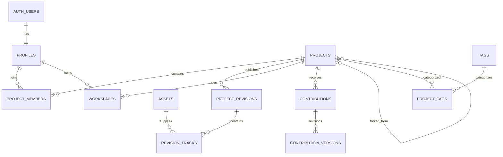

# Data Model and Supabase Design

Status: Proposed  
Database: Supabase Postgres

## Modeling principles

- Keep mutable collaboration metadata separate from immutable musical history.
- Normalize relationships needed for authorization, discovery and attribution.
- Use JSONB only for versioned vendor manifests or flexible event payloads, not primary relationships.
- Store large binary objects in Storage and their identity/authorization metadata in Postgres.
- Prefer restrictive constraints and explicit state transitions over application convention.

## Relationship overview



## Enumerations

Use Postgres enums only for stable lifecycle sets. Additive enum migrations are acceptable; frequently changing taxonomies use tables.

```sql
create type account_status as enum ('active', 'suspended', 'deleted');
create type project_visibility as enum ('private', 'unlisted', 'public');
create type project_status as enum ('draft', 'active', 'archived', 'deleted');
create type member_role as enum ('owner', 'editor', 'viewer');
create type asset_status as enum ('uploading', 'processing', 'ready', 'failed', 'deleted');
create type asset_kind as enum ('audio', 'project_snapshot', 'mix_preview', 'waveform_peaks', 'image');
create type workspace_status as enum ('active', 'submitted', 'abandoned');
create type contribution_status as enum
  ('draft', 'submitted', 'changes_requested', 'accepted', 'rejected', 'withdrawn');
```

## Identity

### `profiles`

| Column                 | Type               | Rules                                                         |
| ---------------------- | ------------------ | ------------------------------------------------------------- |
| `id`                   | `uuid`             | PK and FK `auth.users(id)` on delete restrict                 |
| `username`             | `text null`        | display casing; 3–30 chars; no leading `@`; null before claim |
| `username_normalized`  | `text null`        | lower-case canonical value; unique; paired with username      |
| `display_name`         | `text null`        | 1–80 chars; null during onboarding                            |
| `credit_name`          | `text null`        | 1–120 chars; snapshots copied to published credits            |
| `bio`                  | `text null`        | max 500 chars                                                 |
| `status`               | `account_status`   | default active                                                |
| `profile_completed_at` | `timestamptz null` | requires username, display name and credit name               |
| `created_at`           | `timestamptz`      | default `now()`                                               |
| `updated_at`           | `timestamptz`      | trigger-maintained                                            |
| `last_active_at`       | `timestamptz null` | throttled update, not every request                           |

Recommended checks:

```sql
check ((username is null) = (username_normalized is null)),
check (username is null or (username = btrim(username) and username ~ '^[A-Za-z0-9_]{3,30}$')),
check (username is null or username_normalized = lower(username)),
check (display_name is null or (display_name = btrim(display_name) and char_length(display_name) between 1 and 80)),
check (credit_name is null or (credit_name = btrim(credit_name) and char_length(credit_name) between 1 and 120)),
check (bio is null or char_length(bio) <= 500)
```

The Auth trigger inserts only the user ID and ignores provider metadata, producing an incomplete row. Only completed active profiles are public. A security-invoker `public_profiles` view exposes safe identity columns; authenticated users may additionally read their own safe projection while incomplete, suspended or deleted. Application roles have no direct profile DML, and lifecycle/activity columns are not selectable through the public view. Profile completion is a separate onboarding command, not a direct update policy.

Reserve names such as `admin`, `api`, `auth`, `explore`, `projects`, `settings`, `support` in a non-readable `reserved_usernames` table. Claim through one self-authorized security-definer function with a fixed empty `search_path`, row lock and unique index on `username_normalized`. Claims are idempotent for the same normalized name; renames and reassignment are deferred.

Administrator membership lives in unexposed `private.app_admins`; the no-argument `private.is_admin()` helper checks only the current authenticated user and grants no automatic RLS bypass. Avatar persistence is deferred until the asset pipeline can enforce asset ownership and image-kind integrity.

The `profiles.id` foreign key deliberately uses `on delete restrict`: deleting an Auth user must wait for the future account-deletion workflow to anonymize identity safely without erasing attribution.

Do not duplicate email into `profiles`. Email comes from `auth.users` for the authenticated viewer only. This prevents accidental exposure through profile selects and avoids sync bugs.

## Projects and membership

### `projects`

| Column                                     | Type                 | Rules                                                                     |
| ------------------------------------------ | -------------------- | ------------------------------------------------------------------------- |
| `id`                                       | `uuid`               | PK                                                                        |
| `owner_id`                                 | `uuid`               | FK profiles                                                               |
| `title`                                    | `text`               | 1–120 chars                                                               |
| `description`                              | `text null`          | max 5,000 chars                                                           |
| `visibility`                               | `project_visibility` | default private                                                           |
| `status`                                   | `project_status`     | default draft                                                             |
| `open_to_contributions`                    | `boolean`            | default false                                                             |
| `bpm`                                      | `numeric(6,3) null`  | > 0 and <= 400                                                            |
| `musical_key`                              | `text null`          | canonical application enum value                                          |
| `time_signature_numerator`                 | `smallint`           | default 4, 1–32                                                           |
| `time_signature_denominator`               | `smallint`           | default 4, in 1,2,4,8,16,32                                               |
| `license_code`                             | `text`               | FK `licenses(code)`                                                       |
| `current_revision_id`                      | `uuid null`          | FK added after revisions table; same project enforced in publish function |
| `source_project_id`                        | `uuid null`          | fork lineage FK projects                                                  |
| `source_revision_id`                       | `uuid null`          | exact fork base FK revisions                                              |
| `created_at`, `updated_at`, `published_at` | `timestamptz`        | lifecycle timestamps                                                      |
| `deleted_at`                               | `timestamptz null`   | soft deletion                                                             |

`source_project_id` and `source_revision_id` are either both null or both non-null. A fork cannot reference itself. Cycle prevention belongs in the fork function, although normal creation only points backward.

### `project_members`

Composite PK `(project_id, user_id)`, role, `created_at`, and `created_by`. Ensure exactly one owner using a partial unique index on `(project_id) where role = 'owner'`. For MVP this row must match `projects.owner_id`. Keeping membership separate prevents a future disruptive RLS rewrite.

### Taxonomies

- `genres(id, slug, name, is_active)` and `project_genres(project_id, genre_id, is_primary)`.
- `tags(id, slug, display_name, created_by, status)` and `project_tags(project_id, tag_id)`.
- `instruments(id, slug, name, parent_id, is_active)` for controlled stem roles.
- Unique composite keys prevent duplicates. Project write policy limits counts (for example 3 genres and 10 tags).

Do not encode genres/instruments as enums; the vocabulary will evolve.

## Immutable revisions and tracks

### `project_revisions`

| Column                     | Type          | Rules                               |
| -------------------------- | ------------- | ----------------------------------- |
| `id`                       | `uuid`        | PK                                  |
| `project_id`               | `uuid`        | FK projects                         |
| `revision_number`          | `integer`     | positive; unique per project        |
| `parent_revision_id`       | `uuid null`   | previous revision                   |
| `created_by`               | `uuid`        | FK profiles                         |
| `message`                  | `text null`   | max 500 chars                       |
| `snapshot_asset_id`        | `uuid`        | immutable OpenDAW snapshot          |
| `manifest`                 | `jsonb`       | validated versioned portable subset |
| `manifest_version`         | `smallint`    | explicit schema version             |
| `engine`                   | `text`        | initially `opendaw`                 |
| `engine_version`           | `text`        | exact package/format version        |
| `duration_ms`              | `bigint`      | non-negative verified duration      |
| `mix_preview_asset_id`     | `uuid null`   | derived audio                       |
| `accepted_contribution_id` | `uuid null`   | provenance                          |
| `created_at`               | `timestamptz` | immutable                           |

Unique `(project_id, revision_number)`. `parent_revision_id` must belong to the same project, enforced in the publishing function. Deny update/delete to application roles. Corrections create a new revision.

### `revision_tracks`

This is the queryable, engine-neutral track projection:

| Column             | Type           | Notes                                                 |
| ------------------ | -------------- | ----------------------------------------------------- |
| `id`               | `uuid`         | stable track identity where carried between revisions |
| `revision_id`      | `uuid`         | part of composite PK                                  |
| `asset_id`         | `uuid`         | source audio asset                                    |
| `opendaw_track_id` | `text`         | adapter mapping, not global identity                  |
| `name`             | `text`         | 1–120 chars                                           |
| `instrument_id`    | `uuid null`    | controlled taxonomy                                   |
| `position_ms`      | `bigint`       | >= 0                                                  |
| `trim_start_ms`    | `bigint`       | >= 0                                                  |
| `duration_ms`      | `bigint`       | > 0 and within asset duration                         |
| `gain_db`          | `numeric(6,3)` | bounded application range                             |
| `pan`              | `numeric(5,4)` | -1 through 1                                          |
| `muted`            | `boolean`      | default false                                         |
| `soloed`           | `boolean`      | saved workspace preference                            |
| `sort_order`       | `integer`      | non-negative                                          |
| `added_by`         | `uuid`         | attribution source                                    |

Primary key `(revision_id, id)`. Index `asset_id` for retention/reference checks and `instrument_id` for discovery.

MVP supports one contiguous region per uploaded stem in this projection. OpenDAW may contain richer state, but publishing rejects manifests outside the promoted collaboration subset until corresponding normalized tables/validation exist.

## Assets and storage

### `assets`

| Column                                 | Type            | Notes                                           |
| -------------------------------------- | --------------- | ----------------------------------------------- |
| `id`                                   | `uuid`          | PK; generated before upload                     |
| `owner_id`                             | `uuid`          | uploader, not necessarily sole credited creator |
| `kind`                                 | `asset_kind`    | object purpose                                  |
| `status`                               | `asset_status`  | upload lifecycle                                |
| `bucket`                               | `text`          | constrained allowlist                           |
| `object_path`                          | `text`          | unique, server-generated                        |
| `original_filename`                    | `text null`     | display only; sanitized                         |
| `media_type`                           | `text`          | verified MIME                                   |
| `byte_size`                            | `bigint`        | non-negative                                    |
| `sha256`                               | `text null`     | lowercase 64-char hex                           |
| `duration_ms`                          | `bigint null`   | verified for audio                              |
| `sample_rate_hz`                       | `integer null`  | audio metadata                                  |
| `channels`                             | `smallint null` | 1–8 initially                                   |
| `created_at`, `ready_at`, `deleted_at` | `timestamptz`   | lifecycle                                       |

Storage paths must not embed mutable usernames:

```text
audio/{owner_uuid}/{asset_uuid}/source
snapshots/{owner_uuid}/{asset_uuid}/project.opendaw
derived/{asset_uuid}/preview.webm
derived/{asset_uuid}/peaks.v1.bin
avatars/{user_uuid}/{asset_uuid}/avatar.webp
```

Do not globally deduplicate uploads in MVP: identical hashes can belong to different access domains and deletion expectations. Hashes provide integrity and later dedupe analysis.

Add `asset_credits(asset_id, user_id nullable, credit_name_snapshot, role, position)` so attribution survives profile renames and can represent non-user performers. `owner_id` is operational ownership, not authorship.

## Workspaces and contributions

### `workspaces`

Mutable private drafts:

- `id`, `project_id`, `owner_id`
- `base_revision_id null`
- `snapshot_asset_id`, `manifest jsonb`, `manifest_version`, `engine`, `engine_version`
- `status`, `lock_version integer`, `created_at`, `updated_at`
- optional `contribution_id`

Unique active personal workspace per `(project_id, owner_id, contribution_id)` using an appropriate partial index. Saving requires the expected `lock_version`, then increments it.

### `contributions`

- `id`, `project_id`, `author_id`, `base_revision_id`
- `title`, `description`
- `status`, `current_version_id`
- `submitted_at`, `reviewed_at`, `reviewed_by`
- `review_note`, `created_at`, `updated_at`

State transitions occur only through database functions/service commands. Authors can withdraw; owners can request changes, accept or reject. Accepted/rejected records remain immutable audit history.

### `contribution_versions`

Immutable submission attempts: `id`, `contribution_id`, positive `version_number`, `snapshot_asset_id`, `manifest`, engine fields, `created_by`, `created_at`. Unique `(contribution_id, version_number)`. A contribution’s `current_version_id` must belong to it.

Rejected and withdrawn contributions remain selectable by their author and the project owner while the project exists. They are excluded from public project pages, discovery, activity feeds and public profile contribution lists. An author may request earlier deletion unless the contribution was accepted or is under a moderation/legal hold.

## Quotas, reports and moderation

Quota usage is calculated from active, uniquely stored source assets rather than revision references, so revisions and forks do not double-count bytes:

- `user_storage_usage(user_id, source_bytes, updated_at)` is a transactionally maintained cache; authority remains the referenced `assets` rows.
- `project_storage_usage(project_id, source_bytes, stem_count, updated_at)` accelerates admission checks.
- Upload-finalization and publish functions recheck 45 MiB/file, 10 minutes/file, 12 stems/project, 250 MiB/project and 200 MiB/user under a transaction lock.
- A server-side capacity check rejects new source uploads at the global 850 MiB soft stop. Clients cannot override it.

Add `moderation_reports(id, reporter_id, target_type, target_id, reason, details, status, assigned_to, created_at, resolved_at)` and `moderation_actions(id, report_id, moderator_id, action, reason, expires_at, created_at)`. Target type and ID are validated by a report command rather than allowing arbitrary polymorphic inserts. Only the reporter may see their submitted report status; report detail and all actions are administrator-only.

## Discovery and activity

- `project_stats(project_id PK, play_count, fork_count, contribution_count, accepted_contribution_count, last_activity_at, trending_score, updated_at)` is a derived cache, never authorization authority.
- `activity_events(id bigint identity, actor_id, event_type, project_id, subject_id, payload jsonb, created_at)` is append-only and contains no secrets.
- Search uses a generated/stored weighted `tsvector` for title, description and tags plus B-tree indexes for BPM, key, status, visibility and timestamps.
- Trigram indexes may support username/project-title typo tolerance after measuring query plans.
- Trending formula is versioned and recomputed from recent bounded events; exclude self-generated refresh/play spam.

## Important indexes

At minimum:

```sql
create unique index profiles_username_normalized_uq on profiles (username_normalized);
create index projects_discovery_idx
  on projects (published_at desc)
  where visibility = 'public' and status = 'active' and deleted_at is null;
create index projects_bpm_idx on projects (bpm)
  where visibility = 'public' and status = 'active';
create unique index project_revisions_number_uq
  on project_revisions (project_id, revision_number);
create index revision_tracks_asset_idx on revision_tracks (asset_id);
create index contributions_review_queue_idx
  on contributions (project_id, submitted_at)
  where status = 'submitted';
create unique index assets_object_path_uq on assets (bucket, object_path);
```

Every foreign-key column used for delete/reference checks needs a supporting index. Verify indexes with actual query plans before adding speculative composites.

## RLS policy matrix

RLS predicates should call small, stable helper functions such as `is_project_member(project_id, minimum_role)` where useful. Mark security-definer helpers carefully, set `search_path`, and revoke public execute unless intended.

| Resource                          | Anonymous                                                                               | Signed-in user                                         | Owner/reviewer                  |
| --------------------------------- | --------------------------------------------------------------------------------------- | ------------------------------------------------------ | ------------------------------- |
| Public active profile             | select                                                                                  | select                                                 | update own limited fields       |
| Public published project/revision | select                                                                                  | select                                                 | mutate project through commands |
| Unlisted project                  | select with unguessable ID/link                                                         | same                                                   | full project access             |
| Private project                   | none                                                                                    | member select                                          | owner mutation                  |
| Workspace                         | none                                                                                    | owner select/update                                    | no access unless same user      |
| Contribution                      | none                                                                                    | author select; submitted visible to project owner      | owner review                    |
| Source asset                      | no direct row/object access unless referenced by viewable revision and download allowed | signed access based on project/contribution membership | signed access                   |

Avoid permissive direct updates to lifecycle columns. Expose functions such as:

- `claim_username(p_username text)`
- `create_project(...)`
- `publish_project_revision(...)`
- `submit_contribution(...)`
- `review_contribution(...)`
- `fork_project(...)`

Each function verifies `auth.uid()`, validates current state, uses row locks where needed and returns the created/updated IDs.

## Deletion and retention

- Account deletion immediately changes status, revokes sessions and anonymizes public profile presentation according to policy.
- Published credit snapshots remain as required for attribution, even if the account is deleted, subject to legal policy.
- Project soft-delete hides it and blocks new signed URLs.
- A scheduled collector deletes Storage objects only when no live workspace, revision, contribution, fork or derived asset references them and the retention window has elapsed.
- Never use cascading deletion from profiles to published revisions or credits.
- Failed/incomplete uploads expire after 24 hours; inactive abandoned workspaces after 30 days; soft-deleted project/account objects after a 30-day recovery period.
- Moderation and security audit metadata is retained for 180 days. A legal/abuse hold suppresses scheduled deletion.

## Type generation

Generate database types from the actual local/linked Supabase schema in CI. Domain types are separate and deliberately smaller than rows. Do not hand-maintain a duplicate `Database` interface. Validate JSON manifests with a versioned runtime schema before writes and after reads.
